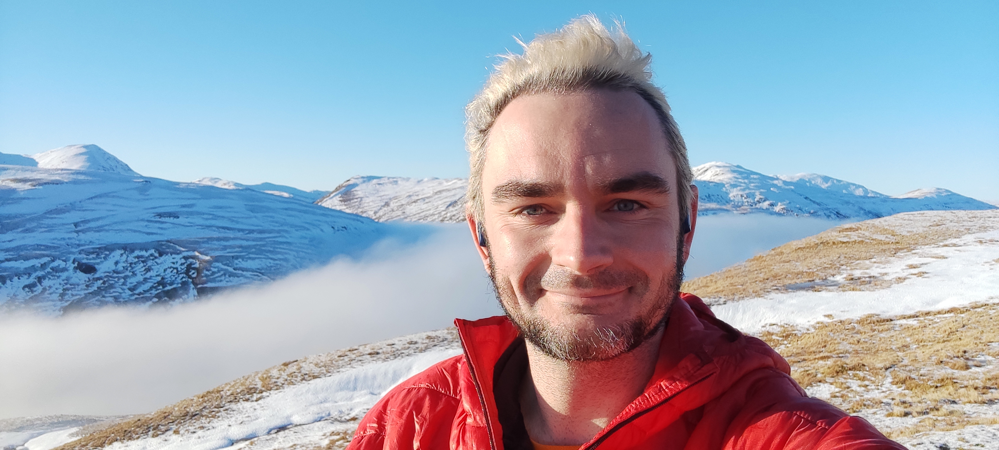

<h1> {{title}}</h1>

{{description}}

🍩 I'm the **Digital Platform Lead** at [Doughnut Economics Action Lab (DEAL)](https://doughnuteconomics.org/) - an org dedicated to fostering post-capitalist economies that are regenerative and distributive by design. (The views expressed on this website are solely my own, though).

🎮 I'm a **game developer**. I worked in the games industry for several years before switching gears to focus on the climate crisis. [Check out the games I've worked on.](/tags/games/)

👩‍💻 I'm a **web designer & developer**. In my current job I am responsible for UI/UX design, product design, and full-stack development for a community platform.

✊ I'm an **organiser**. In 2018 I helped found the [Game Workers branch of the IWGB](https://www.gameworkers.co.uk/) – the UK's first trade union dedicated to workers in the games industry.

✍ I'm a **writer**. I write about the climate crisis, technology, politics, and more, both professionally and generally to make sense of the world. [Explore my writing](/writing).

👩‍💻 I'm an **open source tinkerer**. I release many of [my own projects](/projects) under open licenses, and I like to [contribute to open source projects](https://github.com/Spydarlee) when I have time.

🚵‍♀️ I'm an **outdoorsy person** (when I'm not indoors, which is.. also often). I love hiking, cycling, cycle touring, camping, wild swimming, all the good stuff.

📷 I'm an **amateur photographer**. I take a *lot* of [photos](/photos) with a focus on nature, whether it's snowy mountains, lush forests, or tiny flowers and insects.

💌 You can reach me via email at: karn[at]karnbianco.co.uk.
