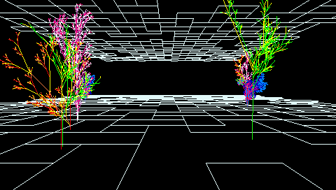
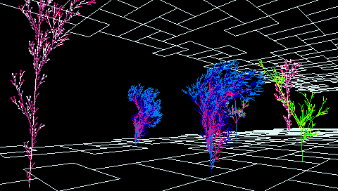

My L-System demo was written in C for the PlayStation Portable, using an official PSP Devkit. It is designed to simulate moving through a virtual forest environment, with trees growing/shrinking as the user/camera moves through the world. The camera can be manipulated on the fly, allowing users to pause, look around, and admire their surroundings – if they so wish!

### L-Systems

L-Systems (or Lindenmayer systems) were created by Hungarian biologist Aristid Lindenmayer to describe the development of simple multicellular organisms. They were later developed by Przemysaw Prusinkiewicz and others – to describe more complex, branching structures. They are generated recursively, which leads to fractal-like self-similarity.

L-Systems are essentially a string of characters which can be represented graphically using a turtle interpretation of the string. Turtle graphics interprets each character/letter within the string as a command for an imaginary turtle with a position and orientation in the world. Commands include move forward and draw, turn left, and so on, which can be combined to create intricately complex systems.

### My Demo

My L-System demonstration features 6 unique L-Systems. Five of these are scholastic (semi-randomised), bracketed (branching) systems which represent “trees”, while the sixth is a simple DOL-system (deterministic, non-random) which resembles a grid and serves as the floor and ceiling of the virtual world.

Each scholastic L-System is generated using a selection of randomly-chosen rewriting rules, allowing for variations of the same basic L-system. This reduces the artificial regularity which would otherwise be evident in a scene with multiple copies of the same L-System. Each of these “trees” actually exists in a 2D plane is constantly rotated to face the camera at all times.

A new colour for the L-System is chosen from an indexed colour table at each branch of a “tree”, highlighting L-System’s ability to accurately represent organic structures. Trees are then rendered gradually – with the number of branches increasing/decreasing every frame to simulate organic growth. Trees constantly move forwards to simulate “walking” through a forest.

The entire demo utilizes exactly **4 KB** of pre-linkage text (programming instructions) and **1 KB** of static data. Unfortunately I cannot upload the source code in its current form due its use of PSP library code. I am, however, currently working on a cross-platform version of the project which will also run on Windows PCs via DirectX.
