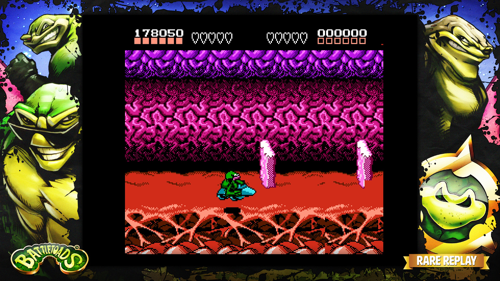
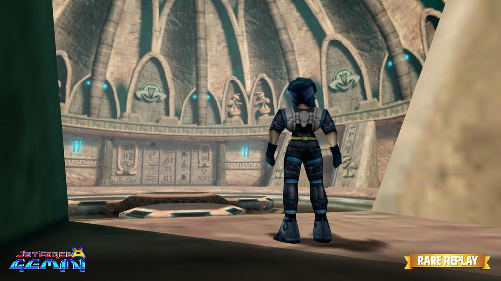

Press A! Hooray! It’s time for _Rare Replay_!

What a special project this was to work on. I’ve been a fan of Rare’s games for as long as I can remember. _Diddy Kong Racing_ was the first game I ever owned as a kid (I’d only really played my parents’ games and rentals up until then) and unwrapping _Banjo-Kazooie_ on Christmas morning (1998) and then immersing myself in it for the remainder of the day is still a vividly clear memory.

So you can imagine my excitement at having the opportunity to revisit 30+ years of the studio’s history in order to lovingly package them together for fans across the globe. And this was no cheap cash-in with a few roms stuffed on a disc, oh no! Each game was lovingly treated: there’s behind the scenes documentaries, never-before-heard music, and loads more.

<iframe width="560" height="315" src="https://www.youtube-nocookie.com/embed/iYbU1uKPaGU?si=oLAvd-TJsQ_xLH3L" title="YouTube video player" frameborder="0" allow="accelerometer; autoplay; clipboard-write; encrypted-media; gyroscope; picture-in-picture; web-share" referrerpolicy="strict-origin-when-cross-origin" allowfullscreen></iframe>
### So what did I do during development?

First and foremost it was my job to provide a mechanism for two key features: snapshots and achievements. Snapshots are bite-size challenges that encapsulate a nugget of gameplay from a game and present it in an accessible (but not always easy!) way. So you might be asked, for example, to kill 20 enemies in _Jetpac_ without dying. Each snapshot has an online leaderboard to encourage replayability and a bit of friendly competition.

But to achieve any of this we needed to know when an enemy is killed and when the player dies. In a game built from source that’s trivial enough, but in a game from 1983 that was written in hand-rolled assembly code? Not so simple. Especially given that a lot of the original source (and any helpful comments and documentation) for these games has long since been lost to the ages. A problem that’s [not so uncommon in the industry](http://www.polygon.com/2015/1/27/7921837/grim-fandango-remastered-interview-double-fine-disney-lucasfilm-sony).

That’s where I came in. It was my job to dig through binaries and assembly code in an attempt to reverse engineer each game to a point where we could hook onto specific gameplay events. This also meant becoming at least somewhat familiar with an array of processors and assembly languages to cover all our platforms: Spectrum (Z80), NES (6502), Arcade (TMS320), and Nintendo 64 (MIPS). I could write an entire article on the process of doing that for each platform, but needless to say it was a heck of a learning experience. And way more fun than it might sound.

]
It’s all well and good having these hooks, but assembly code isn’t very accessible for designers. Early on, then, I went away and had a think and decided to create a simple scripting system that would allow a designer to take all these magic memory addresses and build snapshots around them. I settled on integrating Lua into our engine and wrote some mechanisms that would send callbacks from each of our various emulators when a certain line of code was hit, or a given memory address was written to (e.g. the player’s lives was reduced). Designers could then write a script to chain these together and create a variety of interesting challenges with various goals and criteria.

For the most part we didn’t alter the original games very much because we wanted to provide a faithful recreation of each experience as best as possible, but there were a few exceptions. There’s a _Jetpac_ snapshot, for example, with no platforms (every level in the original Spectrum game had the same three platforms in the same location), but by far the largest alteration I made was in an effort to celebrate perhaps the most infamous level of any Rare game: _Battletoads’_ Turbo Tunnel. Notoriously difficult (even though the rest of the game is much harder) there was only ever one possible modification to pursue: make it loop infinitely. Sorry/not sorry.

I also refactored the various Spectrum game menus to make them more sensible for an Xbox One title. There wasn’t much need for an option to choose between keyboard and Kempston Joystick input, for example. The last major alteration, though, was for _Jet Force Gemini_, which, although an excellent game, features a control/aiming system that is very clearly a product of its time. To modern players the lack of dual analogue stick controls can feel very jarring so that’s exactly what I added. Well. Sort of. It certainly feels more natural at any rate. It’s totally optional, too, so you can revert to the original controls at any time if you prefer. But it’s been very gratifying to see the [overwhelmingly positive response](http://www.rarefandabase.com/jet-force-gemini-will-have-dual-analog-controls/) to the new controls.

]
The _Rare Replay_ team was a pretty small, tight-knit group so there was plenty of other work to go around. I also chipped in with some user interface and general systems work throughout development, but it was the siren call of the reverse engineer that blared loudest. I can’t imagine myself ever getting the chance to work on something like this again, but it was a joy while it lasted.
