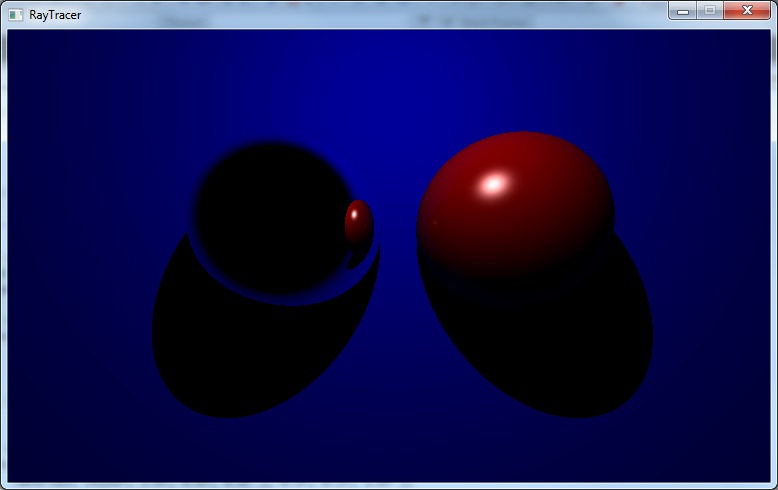

My simple ray tracer written in C++ demonstrates a recursive ray tracing algorithm for rendering a scene made up of 3D primitives (spheres and planes in this case). This method stands in contrast to traditional rasterization-based approaches which are typically supported by accelerated graphics hardware and used in real-time games. The following scenes were both rendered in under a second:

Ray tracing works by firing a series of rays – representing light rays, albeit in reverse – from a given viewpoint through an image plane in a 3D scene. When one of these rays hits an object in the scene, the colour of the object at that point is used as the colour of the image plane pixel the ray passed through on its journey. This colour is typically determined using the [Phong shading model](http://en.wikipedia.org/wiki/Phong_shading), which combines ambient, diffuse and specular lighting components.

More advanced effects such as reflection and refraction can be simulated by recursively tracing additional rays, originating at the point of the previous intersection, and checking those rays for collisions with other objects. The number of these sequential “bounces” is usually limited to some fixed number in order to avoid an infinite loop (not to mention that it becomes difficult to see any noticeable impact on visual quality after a given recursive depth).

In the interest of science I am attaching a series of screenshots I captured during development. Each highlights a particularly interesting failed attempt at implementing a particular feature. Hover over each image for a brief description of what’s going on, or click for a larger version.


  
    
  


My ray tracer currently supports sphere and plane primitives, point lights, Phong shading (diffuse and specular lighting), reflections, and shadows. Eventually I hope to implement extra primitives (triangles and cubes), other light sources (directional and spot), refractions, and spatial partitioning for rendering large scenes.
