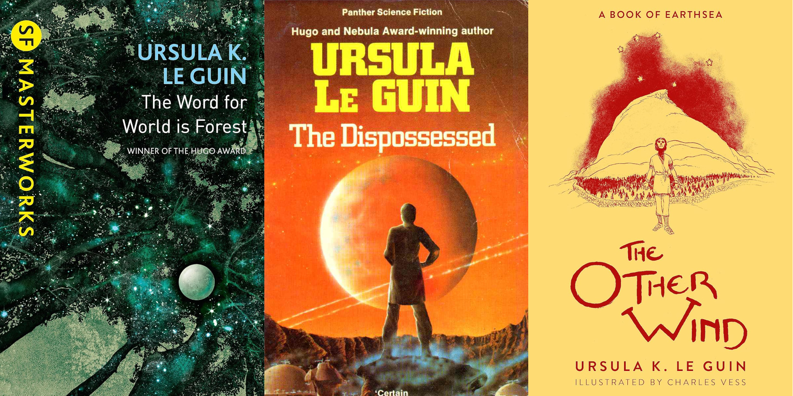
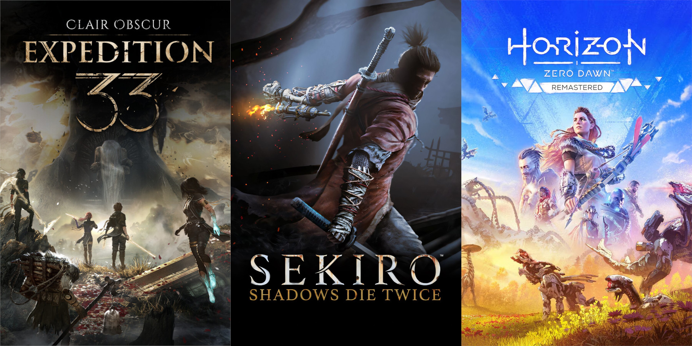
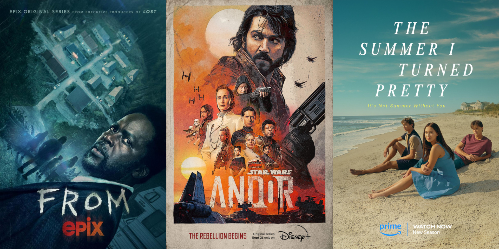
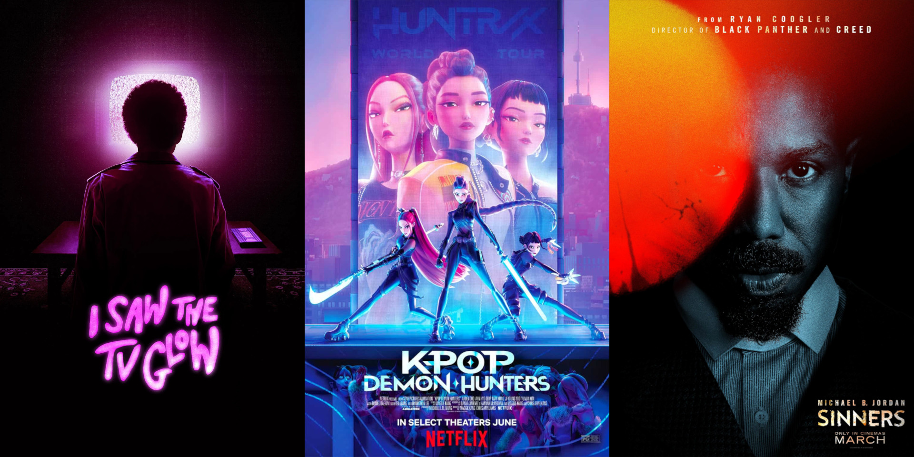

Happy New Year!

I knew I wanted to reflect on the media that stood out to me in 2025 (whether or not it came out in 2025), but I cram *quite* a lot of stuff into my poor head each year, so I've limited myself to three picks per medium, and a few quick sentences per pick. Plus some honourable mentions, as a treat.
## Non-Fiction Books

### [Human Strike and the Art of Creating Freedom](https://mitpress.mit.edu/9781635901368/human-strike-and-the-art-of-creating-freedom/) by Claire Fontaine
A collection of feminist texts on revolutionary love; on means that carry ends within themselves; on breaking away from the violence of economic productivity; on knowing freedom by experiencing it; on living in perpetual revolt against what is reactionary in all realms of life, not just at work, including within revolt itself.
### [Change the World Without Taking Power](https://en.wikipedia.org/wiki/Change_the_World_Without_Taking_Power) by John Holloway
An embrace of self-emancipation and the kinds of revolution that spring from ordinary, everyday life. If the world cannot be changed through the state, through the seizing of power over others, then what are the alternatives? Can we move beyond power? Offers more questions than answers, but lots to chew on nonetheless.
### [Resisting AI: An Anti-fascist Approach to Artificial Intelligence](https://en.wikipedia.org/wiki/Resisting_AI) by Dan McQuillan
A thorough examination of how and why current "AI" technologies align so well with fascism, eugenics, and white supremacy. Plus how we can resist, not just by challenging the tech, but also the conditions that gave rise to it in the first place. Written shortly before the generative "AI" boom, but no less relevant today.

**Honourable mentions:** [Rojava: Revolution, War and the Future of Syria’s Kurds](https://www.plutobooks.com/9780745337722/rojava/) by Thomas Schmidinger; and [The Lost Rainforests of Britain](https://en.wikipedia.org/wiki/The_Lost_Rainforests_of_Britain) by Guy Shrubsole.
## Fiction Books

### [The Word for World is Forest](https://en.wikipedia.org/wiki/The_Word_for_World_Is_Forest) by Ursula K. Le Guin
An engrossing sci-fi story in which a non-violent indigenous population must defend their planet against militaristic alien invaders. Written in the early 70s, the anti-colonial and ecological themes are still depressingly relevant today.
### [The Dispossessed](https://en.wikipedia.org/wiki/The_Dispossessed) by Ursula K. Le Guin
What if all the anarchists migrated to the moon and left the capitalists (and authoritarian leftists) behind? A utopian story, but a grounded one (despite the space travel) that doesn't shy away from hard questions or gravitate toward easy answers and simplistic happy-ever-afters.
### [The Other Wind](https://en.wikipedia.org/wiki/The_Other_Wind) by Ursula K. Le Guin
You might have noticed a pattern by now. 2025 was the year I finally gorged on Ursula K. Le Guin's bibliography, including this moving conclusion to the Earthsea series that served as a more than fitting send off to that intricately realised fantasy world. 

**Honourable mentions:** Literally all the *other* Ursula K. Le Guin books and short stories in the Earthsea and Hainish series', plus [Hermetica](https://detritusbooks.com/products/hermetica-by-alan-lea) by Alan Lea.
## Games

### [Clair Obscur: Expedition 33](https://en.wikipedia.org/wiki/Clair_Obscur:_Expedition_33)
"Oh, the game that won all the Game of the Year awards? How original." *But hear me out*. I genuinely went in with no expectations, and fell in love. A highly original story with interesting and well-developed characters, a unique and beautiful world, *and* super compelling gameplay and combat systems? Yes, please.
### [Sekiro: Shadows Die Twice](https://en.wikipedia.org/wiki/Sekiro:_Shadows_Die_Twice)
Why this and not Silksong, a soulsike which I *also* loved playing this year? In short, unlike Silksong at several points, I never once felt frustrated playing Sekiro. The parry-based combat is *so* slick and intuitive that I could feel myself improving constantly, never once felt cheated by a fight, and was always eager to jump back in. Bliss.
### [Horizon Zero Dawn](https://en.wikipedia.org/wiki/Horizon_Zero_Dawn)
Ahh, the pleasure of not just finally getting to a game that's been on the to-play list for *years*, but having it fully live up to expectations. An enticing post-apocalyptic narrative set in a gorgeous techno-primitivist world that is a joy to both explore, and to fight robot dinosaurs in.

**Honourable mentions**: Hollow Knight: Silksong, Blue Prince, PEAK, Avowed, Wheel World, WUCHANG: Fallen Feathers, South of Midnight, Baldur's Gate 3.
## TV Shows

### [FROM](https://www.imdb.com/title/tt9813792/)
What if LOST had been a horror show? Okay, that's a big oversimplification, but the mystery box setup and some familiar faces, on both sides of the camera, do lend it some credence. I binged the three current seasons in about a week and they were grim, quite depressing, truly unnerving at times, but thoroughly compelling.
### [Andor](https://www.imdb.com/title/tt9253284/)
I'll watch most anything set in the Star War universe but Andor really is in a league of its own. A tale of revolution and rebellion that doesn't follow the stories of space police wizards, but rather the everyday people who choose to stand up against the unfathomable power of a galaxy-spanning fascist empire.
### [The Summer I Turned Pretty](https://www.imdb.com/title/tt14016500/)
Sometimes you just need some low stakes coming-of-age romantic drama as a palette cleanser for all the horror and violence, y'know? Although, after all the terrible decisions made by the main trio, I couldn't really describe myself as Team Conrad *or* Team Jeremiah by the end, but hey, what is youth for if not making poor choices?

**Honourable mentions**: Midnight Mass, Murderbot, Digimon Tamers, Man on the Inside, One Piece, Foundation, Ginny & Georgia, Star Trek: Strange New Worlds, Pluribus.
## Movies

### [I Saw the TV Glow](https://www.imdb.com/title/tt15574270)
A surreal, nostalgic, queer — in every sense of the word — psychological horror story that movingly weaves together themes of escapism, identity, transition, and trauma. It follows two teenagers who become so hooked on a Buffy the Vampire-esque TV show *(relatable)* that their hold on reality starts to slip *(also relatable).*
### [KPop Demon Hunters](https://www.imdb.com/title/tt14205554/)
In my mind, any movie musical is an immediate success if I find myself listening to the soundtrack on repeat long after I've finished watching. Such was the case here! The bright and colourful visuals, quirky characters, dynamic action scenes, and fun save-the-world-from-darkness plot were just the icing on the cake.
### [Sinners](https://www.imdb.com/title/tt31193180/)
What's scarier than supernatural undead horrors that stalk you after dark? Well, if you're black and living in the Jim Crow-era southern United States, a few things. Stick both together and you've got a great recipe for a horror film. An entrancing spin on the genre, with an unexpectedly fantastic (and central to the plot) soundtrack to boot.

**Honourable mentions**: One Battle After Another, Wake Up Dead Man: A Knives Out Mystery, Chicken Run.
## Music

### [Sabrina Carpenter](https://en.wikipedia.org/wiki/Sabrina_Carpenter)
I finally quit Spotify this year (their [CEO shacking up with a military "AI" company](https://www.business-humanrights.org/en/latest-news/spotify-faces-boycott-over-ceos-700m-investment-in-ai-military-defence-startup/) was the final straw) so I no longer have detailed analytics on the music I listen to, but I'm pretty confident that Sabrina's latest [catchy, country-flavoured pop album](https://www.youtube.com/watch?v=aSugSGCC12I) was near the top of my most-played list, along with last year's Short n' Sweet.
### [Ecca Vandal](https://eccavandal.com/)
A very welcome new discovery for me this year following the release of her latest single [Cruising To Self Soothe](https://www.youtube.com/watch?v=pccffwLPRSw) which I've listened to on repeat a dangerous number of times. Excited to continue digging into the rest of her alt-rock discography in 2026.
### [Chloe Qisha](https://www.chloeqisha.com/)
Another new discovery thanks to a recommendation from a friend (just like the good old days, before all those pesky algorithms). Super catchy pop bops, about which my only complaint is that there's not more. Current favs include [Modern Romance](https://www.youtube.com/watch?v=vCCy3aFkf_I), [21st Century Cool Girl](https://www.youtube.com/watch?v=M20-Dm-5OBM), and [Sex, Drugs & Existential Dread](https://www.youtube.com/watch?v=flyqRjoWr3s).
## Podcasts

### [Cool People Who Did Cool Stuff](https://www.podbean.com/podcast-detail/gjjae-265851/Cool-People-Who-Did-Cool-Stuff-Podcast)
A historical podcast, hosted by anarchist Margaret Killjoy, exploring how and why rebels, revolutionaries and other weirdos have fought back against oppression across the centuries. Informative *and* entertaining.
### [If Books Could Kill](https://www.ifbookspod.com/)
The latest podcast I have followed host Michael Hobbes into (after You're Wrong About and Maintenance Phase). This time he's teamed up with Peter Shamshiri to dissect popular, bestselling nonfiction books and the myriad of bad ideas they espouse, as well as the harm they do to our collective culture. Snark awaits!
### [Live Like the World is Dying](https://www.tangledwilderness.org/live-like-the-world-is-dying)
"How do we live in a world that might be ending? By preparing to survive that end and by working to prevent it." Another Margaret Killjoy podcast, but this time focused on practical topics related to seriously acknowledging the possibility of societal collapse, but  having that spur us to action rather than despair.

---

Header image photo by [Cheney G](https://unsplash.com/@gcheney?utm_source=unsplash&utm_medium=referral&utm_content=creditCopyText) on [Unsplash](https://unsplash.com/photos/a-television-sitting-on-top-of-a-table-in-front-of-a-book-shelf-YzSs5LcaVBY?utm_source=unsplash&utm_medium=referral&utm_content=creditCopyText)