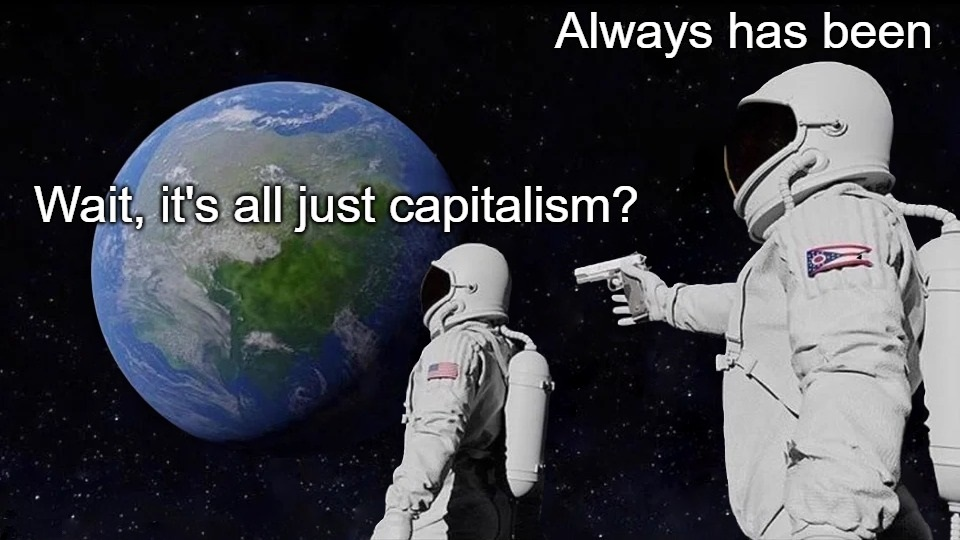
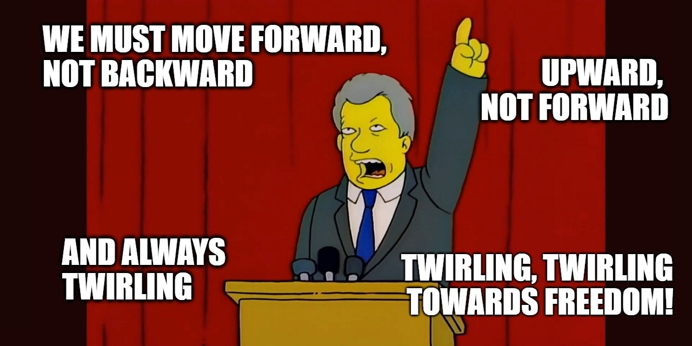
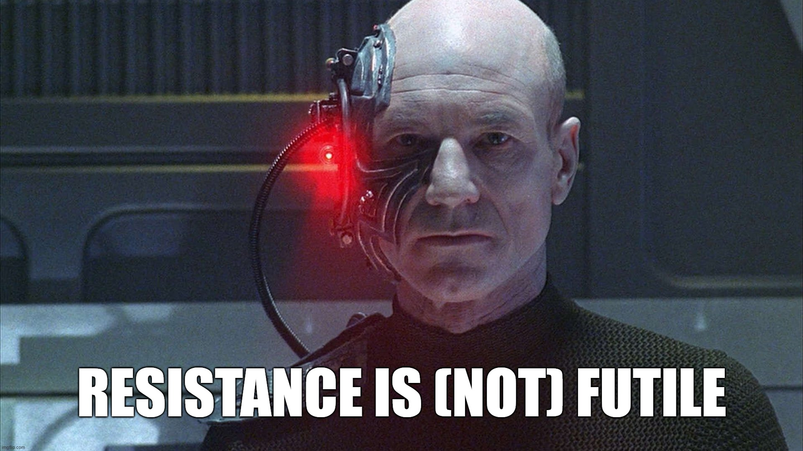
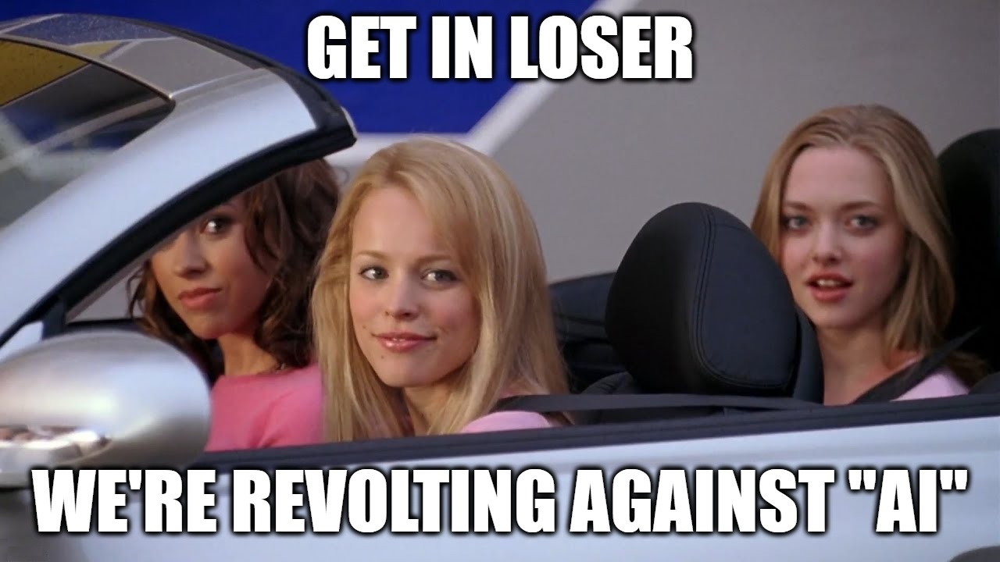

## What is "AI" anyway?

The term "artificial intelligence" was coined back in the 1950s, alongside a field of research brimming with excited optimism about exploring the question: "can we create machines that think?" When researchers failed to meet the incredibly high expectations their optimism had inspired, however, "AI" funding and public awareness all but disappeared during the first "AI winter" of the '70s and early '80s. This boom and bust hype cycle has repeated multiple times in the intervening decades, and we will see if the current boom is *also* set to go bust. [^1]

For now, in the public sphere especially, "AI" has come to be an increasingly broad and imprecise term. It's used to describe everything from autonomous vehicles to chatbots to non-player characters in video games to science fiction characters like C-3PO and HAL 9000. These very different things get smooshed together in our collective imagination, which is great for marketing teams looking to hype up and sell futuristic "AI" solutions, but not so great for meaningful discussions.

If we want to pierce through the marketing and get to specifics, it's useful to have at least a high-level, intuitive understanding of how some key types of "AI" actually work. We don't have to be experts, but a basic level of knowledge can be a very powerful tool if we want to resist being being swept away by the rising hype tide.

### Machine Learning

Machine learning (ML) is the foundation of many, if not most, modern approaches to "AI". It is concerned with the design of algorithms (processes run by computers) that can "learn" (from data such as text, images, video, etc.) without being *explicitly* programmed with step-by-step instructions like most software is.

To give a concrete example: back when I was still making games full-time, I worked on the [Kinect Sports series](https://karnbianco.co.uk/projects/kinect-sports-rivals/) which made use of the [Kinect motion sensor](https://en.wikipedia.org/wiki/Kinect) to allow players to use their physical bodies as an input device, e.g. swinging their arms to play tennis, or kicking their legs to play football.

In a traditional game, it's trivial to map player input onto an in-game action (e.g. "if a player presses the 'X' button, kick the ball") but what about physical actions? How do we detect a person's leg? What *is* a leg? What about different leg shapes and sizes? Is that a human leg or a table leg? Is it a left leg or right left? And so on.

")

It would have been impractical to manually program in all possible answers to these sorts of questions, so machine learning algorithms were used and provided with recordings of many different people performing actions in many different scenarios in order to create a statistical model that could help determine with *some* degree of confidence that "yes, the player just kicked their leg". [^2] [^3]

### Deep Learning and Artificial Neural Networks

Artificial neural networks are, in essence, pattern recognition machines. They're inspired by (but quite distinct from [^4]) biological brains, and fall under a subset of machine learning known as *deep learning* (where deep = structured in layers).

Most neural networks rely on *supervised* learning, which means we humans give them not only input data, but also desired outputs to compare against while they're "learning". Inputs (which could be text, images, video, audio, etc.) get broken down and turned into numerical values which can then be mathematically manipulated as they travel through the network. [^5]

The network is configured by many *parameters* which determine how data gets transformed as it passes through. The goal is to move the system towards being able to make more accurate predictions. It's a bit like a game of "hot and cold". We get "warmer" when a particular network configuration gets us closer to our desired output, and "colder" when it moves us farther away (introduces more errors). [^6]

 video series")

Let's say we want to build a neural network "AI" that can recognise cats. We begin by providing input data from our extensive personal collection of cat photos. For its first run, the neural network assigns random values to all parameters and tries to find a cat in a provided image. It fails, and the network spits out an error (also a number). No problem. The parameters are tweaked [^7] and we go again. And again. And again. Until we've reduced that output error as much as possible.

This is what it means to "train" an "AI": feeding data into the system and then continuously tweaking its parameters to get closer and closer to a desired output. The more parameters in a system, the more complex the tasks it can perform.

### Transformers
Transformers (not those ones) are a special type of neural network that were first described by engineers at Google in 2017. [^8] The power of transformers arises from two key features: improved context tracking and parallelisation.

Most other neural networks and "AI" models operate on inputs, such as text, linearly, from start to finish. This limits both their maximum performance, and their ability to keep track of context over large "distances".

As a slightly crude analogy, imagine you're reading the final chapter of a book and the author makes reference to something from the first chapter. If you've been reading sequentially (as humans tend to do) you might not be able to remember exactly what was said. The "distance" is too great. If, however, you were able to read every page in the book *at the same time* (less common for humans) it would still be fresh in your mind, and you would have the full context.

This ability to do multiple things in parallel also means that transformers are highly scalable and can take advantage of modern computer hardware — CPUs and GPUs with multiple processor cores — to massively boost their performance. [^9]

### Large language models and generative "AI"

Large language models (LLMs) make use of the transformer architecture to process *huge* amounts of text (hence the "large" in their name). These are the models that underpin [ChatGPT](https://en.wikipedia.org/wiki/ChatGPT) and other generative tools. GPT stands for "generative pre-trained transformer", so we can now break these down and demystify them a bit:

- **Generative**: capable of generating text, images, etc.
- **Pre-Trained:** the neural network training has already been done
- **Transformer:** uses the parallel transformer architecture

OpenAI's GPT-3 was trained on 45TB of compressed data, down to "570GB after filtering". That's 1300 or 500 times the size of Wikipedia, for filtered and unfiltered sources respectively. This translated to about 175 *billion* parameters, and required a huge amount computing power and energy for training. [^10]

GPT-3.5 and GPT-4, which power the current iteration of ChatGPT, are even larger. The huge scope of training data is a key part of why ChatGPT can respond to such a wide range of prompts and topics, and why it's captured so much attention since launch. But the basic underlying operating principles of neural networks — as pattern recognition machines and probability maximisers — remains intact.

Generative "AI" is certainly technically impressive, but it's not *magic*. The fact that we do not always fully understand everything these models are doing "under the hood" does not mean that *anything* could be happening. The "black box" at the heart of complex artificial neural networks is simply the result of "AI" breaking down input data into patterns that make little or no *intuitive* sense to humans; we wouldn't approach these problems in the same way because we're not machines. The risk is not that "AI" might be secretly conscious, but rather that we don't know if what it's generating is utter rubbish or not (and neither does the "AI", as well discuss below).

--

All of the "AI" models discussed so far are examples of artificial *limited* intelligence. They are designed to do specific tasks like classifying images, translating text, or responding to prompts. These all exist now. Artificial *general* intelligence (AGI), on the other hand, is a far more speculative type of "AI" that some imagine might be able to do almost anything, and perhaps even.. come alive?

---
## Is "AI" really intelligent? (What is intelligence?)

In March 2023, Microsoft published [Sparks of Artificial General Intelligence](https://arxiv.org/abs/2303.12712), [^11] a widely-covered paper which claimed that GPT-4 was showing early (albeit incomplete) signs of artificial general intelligence (AGI). To claim that something is intelligent, however, requires a definition of intelligence, and the authors' first attempt was.. troubled.

The paper initially cited a source that called on Charles Murray's [The Bell Curve](https://en.wikipedia.org/wiki/The_Bell_Curve) [^12] for a definition of intelligence. Perhaps you're familiar with this infamous book for it's controversial claims — to put it mildly — that race is linked to intelligence, and that people are more likely to end up living in poverty because they have low IQs, among other gems.

> Virtually all proposed theories relating to AGI and its development rely on simplified, quantifiable representations of intelligence. This leads AGI researchers to gravitate towards metrics like IQ, along with all the historical baggage that comes with the use of those metrics.

<cite>— [AGI Researchers Stop Quoting White Supremacists Challenge (Impossible)](https://medium.com/@collegehill/agi-researchers-stop-quoting-white-supremacists-challenge-impossible-d1002469d572)[^13]</cite>

The authors updated the article to clarify that, of course, they don't agree with any of that race pseudo science, but they nevertheless kept the definition of intelligence, at least at first. After receiving additional criticism they dropped the definition of intelligence altogether and replaced it with a disclaimer that "there is no generally agreed upon definition of intelligence".

This isn't an isolated example; simplistic and harmful understandings of intelligence are rife in "AI", but these notions do not go entirely unchallenged.
### Stochastic parrots

[Emily Bender](https://en.wikipedia.org/wiki/Emily_M._Bender) is a computational linguist and outspoken "AI" critic. [Timnit Gebru](https://en.wikipedia.org/wiki/Timnit_Gebru) is an engineer and former "AI" ethicist at Google (before she was fired). Together with several other co-authors they wrote a [paper](https://dl.acm.org/doi/10.1145/3442188.3445922) considering the dangers of ever-expanding large language models (LLMs), while also introducing the concept of "stochastic parrots".

> Contrary to how it may seem when we observe its output, an LM is a system for haphazardly stitching together sequences of linguistic forms it has observed in its vast training data, according to probabilistic information about how they combine, but without any reference to meaning: a stochastic parrot.

<cite>— [On the Dangers of Stochastic Parrots: Can Language Models Be Too Big? 🦜](https://dl.acm.org/doi/10.1145/3442188.3445922)[^14]</cite>

The lack of an agreed upon definition of intelligence hasn't slowed the endless speculation about whether LLMs are capable of "original thought" and creativity, like us humans. Bender and Gebru push back against this by arguing that these models do not operate on the *meaning* of what they generate; they're simply using heuristics to string together output that *appears* coherent.

This is why ChatGPT can spit out completely fictional references, or falsehoods disguised as facts, because it doesn't "understand" anything, it's just generating (often very convincing) patterns of words. These oddities are often described as "hallucinations", an unhelpfully anthropomorphising term that implies a thinking agent having an off day, rather than a machine simply doing exactly what it's been built to do.

> i am a stochastic parrot, and so r u

<cite>— [OpenAI CEO, Sam Altman on x.com](https://x.com/sama/status/1599471830255177728?lang=en)</cite>

> People want to believe so badly that these language models are actually intelligent that they're willing to take themselves as a point of reference and devalue that to match what the language model can do.

<cite>— Emily Bender, [You Are Not a Parrot](https://nymag.com/intelligencer/article/ai-artificial-intelligence-chatbots-emily-m-bender.html)[^15]</cite>

Pushing back against the idea that "AI" is "intelligent" in the human sense of the word doesn't deny that these are technically impressive machines capable of doing nifty things sometimes. But, as we continue to be bombarded by larger-than-life claims about the potential of these technologies, it's important that we can distinguish between marketing hype and reality, including the very real impacts we're already seeing.

---
## What are the social and political impacts of "AI"?

> AI isn't sci-fi but a radical continuity of modernity, of bureaucracy, of austerity; of the anti-worker, anti-poor contempt that stretches from Charles Babbage to Jeff Bezos.

<cite>— [The political intervention in AI that we need right now...](https://www.danmcquillan.org/the-political-intervention-in-ai-that-we-need-right-now.html), Dan McQuillan [^16]</cite>

### Invisible human labour
One downside of training large language models on vast input data sourced from all corners of the internet is that the internet can be a very dark place. In order to keep this darkness from getting into the hands of end users requires a huge amount of thoroughly miserable, and often invisible, human labour.

> OpenAI sent tens of thousands of snippets of text to an outsourcing firm in Kenya, beginning in November 2021. Much of that text appeared to have been pulled from the darkest recesses of the internet. Some of it described situations in graphic detail like child sexual abuse, bestiality, murder, suicide, torture, self harm, and incest.

<cite>— [OpenAI Used Kenyan Workers on Less Than $2 Per Hour to Make ChatGPT Less Toxic](https://time.com/6247678/openai-chatgpt-kenya-workers) [^17]</cite>

Precarious workers in low-income countries far away from the reality of tech companies in Silicon Valley were paid tiny salaries to do often traumatizing work that only an empathetic human being could do. All in the name of propping up a technology that sells itself on doing things that humans *can't* do.

It's a pattern we see repeated again and again. Whether it's "self-driving cars" that still need human drivers as "backups", [^18] or gig economy workers on zero hour contracts fighting algorithmic authoritarianism in order to make ends meet, [^19]  there's a not-so-subtle ideological pursuit afoot to hide, obscure and devalue human labour to the detriment of working people, and the benefit of capital.

### Continuing colonisation
One example of machine learning that many of us have probably been using and benefitting from for years is language translation, via tools such as [Google Translate](https://translate.google.com/). Both text translation and automatic speech recognition have come on leaps and bounds in recent years, but where did the data come from to train these models?

That's a question the team behind [Papa Reo](https://papareo.nz/#kaupapa) — a multilingual indigenous language revitalisation project — asked when OpenAI released its speech recognition system, [Whisper](https://openai.com/blog/whisper/), complete with support for the te reo Māori language. Also, whose permission did they seek to "create a derived work from that data and then open source the derivation?" [^20] There was no good answer.

Preservation of indigenous languages is a crucial task, but one that needs indigenous leadership. What it *doesn't*' need is Big Tech companies like OpenAI (and Amazon, and Google) swanning in, non-transparently sucking up data, and then profiting from the results. Instead, Papa Reo is developing its own small-scale machine learning tools, trained on its own — ethically sourced — datasets, in active partnership with local communities who retain their data rights throughout.

> In theory the open source movement aims to democratise technology like machine learning, which ultimately should be making tech more accessible and usable for minority groups. In practice, only those who have internet, a computer, the education, and other resources ubiquitous among Western countries and certain demographics are able to take advantage of the open source movement. Many indigenous and marginalised communities don't have these resources or ability to benefit from open source because they are continually oppressed by systemic racism, governments, colonialism, and capitalism.

<cite>— [OpenAI's Whisper is another case study in Colonisation](https://blog.papareo.nz/whisper-is-another-case-study-in-colonisation/) [^20]</cite>

Even seemingly positive uses of "AI" can create harmful impacts when undermined by unequal power dynamics. When "AI" is centralized in unaccountable tech companies whose stated goals are to build bigger and bigger and increasingly general purpose tools (to sell to as big an audience as possible), this is inevitably going to end up being at odds with the interests of the marginalized communities in particular.

### Eroding digital autonomy
Should tech companies be free to train their generative "AI" models on any and all data, even copyrighted materials? Writing on the [Creative Commons blog](https://creativecommons.org/2023/02/17/fair-use-training-generative-ai/), Stephen Wolfson argues that, yes, training "AI" models should constitute "fair use", just like when human artists take "inspiration" from their fellow artists. The alternative, he argues, would be a mess of copyright lawsuits that could set a negative precedent for "future technologies." [^21]

> AI content that is itself based on copyrighted materials remains problematic. An inability to rely on copyrighted materials could undermine the ability of the AI system to answer prompts from end users. But if the content is to be based on protected works, we would need to accept a new era of open innovation where the intellectual property rights do not matter.

<cite>— [ChatGPT: what the law says about who owns the copyright of AI-generated content](https://www.port.ac.uk/news-events-and-blogs/blogs/security-and-risk/chatgpt-what-the-law-says-about-who-owns-the-copyright-of-ai-generated-content) [^22]</cite>

 So, is this an exciting moment in which we move away from a flawed system of intellectual property rights towards a commons-based approach? Ehh. Copyright and related laws might be flawed, but they're also lifelines for many smaller artists and creatives who make a living off their work. I'm not going to lose any sleep over generative "AI" training on copyrighted materials from huge corporations, but they're not the only ones who will be impacted. (And when they are impacted they'll be able to hire an army of lawyers to fight back).

Beyond legal arguments there is, I think, a much simpler ethical case to be made based on *consent*. Why shouldn't we all have the right to grant or deny permission for our work, our art, our data, our likeness, to be used by companies for *any* purpose? The main argument against respecting consent seems to rely on the idea that these new "AI" technologies are *so* transformative that we just need to get over ourselves. And yet I am once again reminded that "the social benefits [of "AI"] are still speculative while the harms have been empirically demonstrated". [^23]

### Automating away joy
The promise of automation has long been that it would take over the drudgery of life, the dangerous work, the gross work, the work nobody wants to do, leaving us all with more free time to spend as we will. So why is it that the things people love to do and which give our lives meaning — like writing and creating art — are being outsourced to machines, while so many humans continue to languish in meaningless, underpaid, exploitative, [bullshit jobs](https://davidgraeber.org/books/bullshit-jobs/)?

> If we surrender these things too, even by an inch, then what is left? If we retreat from the notion that there is something ineffable about human nature that cannot be appropriated and automated by machines, we demean the very concept of personhood. I can't think of anything more antihuman.

<cite>— Alex Roddie, [Generative AI will not make you a better writer](https://www.alexroddie.com/2023/09/generative-ai-will-not-make-you-a-better-writer-it-will-destroy-creative-writing-as-a-way-of-expressing-the-human-experience/) [^24]</cite>

Unfortunately, tech companies and their oligarchs do not countenance such fanciful ideas about art, or even humanity (more on that later). As we have seen time and time again, it is not in the interest of tech companies to make people's lives better, except at best as an unintended side effect. Their interests are profit and growth, like all for-profit companies. Are these really the companies and incentives we want in charge of making decisions about our futures?

Every time we use generative "AI" to create something that we *could* have worked with a human to create, are we not limiting opportunities for human thriving? For collaboration? For fulfilment? For joy? We can be sure that corporations who care first and foremost about their bottom lines will happily use generative "AI" to replace artists and churn out low-cost, soulless "art" because they have every incentive to. That doesn't mean the rest of us need to follow suit. We could choose to keep that which makes life worth living for ourselves.

### "AI"-powered states
A few short days after the election of the Labour Party to government in the UK this year, the [Tony Blair Institute for Global Change](https://www.institute.global/) released a paper boldly making the case for "reimagining the state" by leveraging, you guessed it, "AI". [^25]

The paper is littered with excitement about potential boosts to productivity, efficiency, and growth. It presents two distinct ways to take advantage of these "improvements": they *could* be used to help public sector workers in their current jobs and reduce overwhelm and overwork, *or* they could be used to cut a load of jobs entirely:

> The government could choose to shrink the UK's public-sector workforce and bank the fiscal savings. This would involve reducing the workforce by a sixth over the course of a decade, equivalent to slimming the previously growing public sector by half a million roles this parliamentary term and another half a million during the next term.

<cite>— [The Economic Case for Reimagining the State](https://www.institute.global/insights/economic-prosperity/the-economic-case-for-reimagining-the-state)[^25]</cite>

Whether or not we believe the projected impacts of "AI" are accurate once we strip the hype away, the political project is clear: neoliberalism, baby! Shrink the state, reduce government spending, rollout private sector technologies and dependencies "across the entire public sector", and grow private markets. Is this a "reimagined state"? Or more of the same, turbocharged by tech?

This is already happening, with or without "AI". In 2021, the Australian government was ordered to pay a huge settlement after its automated welfare system caused massive harm, and was even linked to multiple suicides. [^26] In 2020, UK councils were forced to abandon their own algorithmic welfare decision tools as a result of bias and a lack of transparency. [^27]

As anyone who has ever been on benefits (✋) can tell you, welfare systems are dehumanizing and bureaucratic enough at the *best* of times. The ideological drive to make these systems more "efficient" makes them a prime target for "AI" — not just as support tools, but as actual "decision makers". The fact that algorithms have no concept of morality also gives the state a shield to hide behind when people's benefits are cut or denied. It's not personal, it's not inhumane, it's just the most efficient solution! The computers said so, and they're neutral and rational!

This is just the tip of the iceberg: [biometric surveillance](https://www.accessnow.org/campaign/ban-biometric-surveillance/), [^28] [predictive policing](https://edri.org/wp-content/uploads/2022/05/Prohibit-predictive-and-profiling-AI-systems-in-law-enforcement-and-criminal-justice.pdf) , [^29] systematizing bias; the list of current and potential state abuses that can be enabled and expanded by "AI" is all-but endless.

### Turbocharging genocide
Project Nimbus is a collaboration between Google, Amazon, and the State of Israel. Signed in 2021, this huge $1.2bn deal ensures that Israel have access to cutting-edge cloud computing services, machine learning, and other "AI" tools. [^30]

Israel has a long history of testing new military technologies, techniques and weapons on the Palestinian people, and then profiting by selling their expertise and "battle-tested" technologies to the rest of the world. [^31] They were one of the world's top 10 arms exporters between 2019 and 2023. [^32]

Whether it's "data-driven" predictions about who might pose a threat to the state, lethal autonomous weapons systems such as "robo-snipers", facial recognition and biometric surveillance to enact apartheid, [^33] or the 'Where's Daddy?' system which "helps target suspected Hamas militants when they're at home with their families", [^34] the proliferation of "AI" has only accelerated since October 7th.

> Beyond such systems' lack of accuracy or human verification, a more existential concern is how their use is fundamentally at odds with human rights, and the inherent human dignity from which those rights derive. This is demonstrated by the reality that Israel's AI targeting systems are working just as intended; as [the IDF](https://www.theguardian.com/world/2023/oct/10/right-now-it-is-one-day-at-a-time-life-on-israels-frontline-with-gaza) has said, "right now we're focused on what causes maximum damage."

<cite>— [Artificial Genocidal Intelligence: how Israel is automating human rights abuses and war crimes](https://www.accessnow.org/publication/artificial-genocidal-intelligence-israel-gaza) [^33]</cite>

We don't need to speculate about hypothetical, Terminator-esque futures where the machines turn against us, the machines are already against us, but they were setup that way by human beings. As in all things, the impacts are not being distributed evenly, and those who were already on the receiving end of state violence are experiencing the worst impacts.

---
## What are the environmental impacts of "AI"?
In its paper arguing for a "reimagined state" where "AI" is deployed "across the entire public sector" in the UK, the [Tony Blair Institute](https://www.institute.global/) makes precisely zero references to the environment, and only a single reference to "climate"... in a footnote with no bearing on its main thesis. It does, however, reference "GDP" a total of 82 times, and "growth" 89 times. [^25]

These omissions exist in spite of an acknowledgement (and celebration) of the fact that the UK is home to the world's third-largest compute capacity, hosting a total of 118 data centres, coming in behind the United States (1,204) and China (437). [^35]

As "AI" models — generative models like ChatGPT in particular — have grown in size and complexity, so have their associated material and energy costs. So big are these costs, in fact, that they have caused Google's emissions to rise by a whopping 50%, and Microsoft's by 30%, putting their net zero ambitions (which were already questionable at best due to their reliance on carbon offsetting) in jeopardy. [^36] The International Energy Agency predicts that electricity demand for "AI" could double by 2026, as data centres come to represent an increasingly large proportion of energy consumption worldwide. [^37]

Tech companies like to justify these impacts with the logic that, yes, "AI" may be pouring fuel on the climate crisis fire now, but it's *also* going to help us solve our ecological problems! [Microsoft's AI For Good Lab](https://www.microsoft.com/en-us/research/group/ai-for-good-research-lab/), for instance, waxes lyrical that "[AI may hold a key to the preservation of the Amazon rainforest](https://news.microsoft.com/source/latam/features/ai/amazon-ai-rainforest-deforestation/?lang=en&form=M402JX&OCID=lock-con2)". [^38] This is greenwashing, pure and simple. Not because there are no potentially useful applications of machine learning to ecological issues, but because it provides a cover for all the other ways Microsoft is pushing "AI" on us which have little, if any, social benefit, but plenty of environmental costs.

> There are already huge resources involved in indexing and searching internet content, but the incorporation of AI requires a different kind of firepower. It requires processing power as well as storage and efficient search. Every time we see a step change in online processing, we see significant increases in the power and cooling resources required by large processing centres.

<cite>— [The Generative AI Race Has a Dirty Secret](https://www.wired.com/story/the-generative-ai-search-race-has-a-dirty-secret/) [^39]</cite>

Like other complex software processes  — such as video editing or rendering large 3D worlds in video games, for instance — generative, multi-purpose "AI" systems (especially image generation tools) are inherently energy-intensive, relative to other software, even when they're just being run locally on personal computers. [^40] The deeper threat, however, emerges from "AI" being rolled out in tools that huge numbers of people use on a day-to-day basis.

As Google, Microsoft, and others, rush to integrate generative "AI" into their search engines, we could see a "fivefold increase in computing power and huge carbon emissions." [^39] Internet search is something almost every internet user relies on, it's not something we can easily opt out of. Incurring large emissions for standalone apps like ChatGPT is one thing, but the insistence that "AI" be injected into every facet of our digital lives has huge ecological implications.

### Growth, growth, growth

The ecological impacts of "AI" go deeper than the direct material and energy costs. Proliferation of "AI" into more and more aspects of our lives is built on a foundational belief that endless economic growth is both necessary, and good.

, [2024](https://x.com/sama/status/1786849158105796675)")

In [Moore's Law for Everything](https://moores.samaltman.com/), [^41] OpenAI CEO Sam Altman insists that "a stable economic system requires two components: growth and inclusivity." He proceeds to lay out his vision for a future in which the deep inequalities caused by capitalism are solved by increasing the size of the economic pie and making everyone an "equity owner", fostering "capitalism for everyone". He chucks in a few progressive policy ideas — such as a wealth tax, and moving towards taxing capital over labour — but situates these firmly within a new flavour of capitalism.

> Capitalism for Everyone: The best way to improve capitalism is to enable everyone to benefit from it directly as an equity owner. This is not a new idea, but it will be newly feasible as AI grows more powerful, because there will be dramatically more wealth to go around.

<cite>— Sam Altman, [Moore's Law for Everything](https://moores.samaltman.com/)[^41]</cite>

Altman predicts that "AI" will ensure that "growth will be extremely rapid", and expects countries could achieve 50% GDP growth in short order. Unfortunately for Sam (and the rest of us) "there is no empirical evidence that absolute decoupling" of GDP growth from resource and energy usage can be achieved, and certainly not at the pace required to keep global heating under 1.5°C or 2°C of warming. [^42] If we are serious about addressing our ecological crises then we need post-capitalist, post-growth economic paradigms — [degrowth](https://en.wikipedia.org/wiki/Degrowth), [wellbeing economics](https://weall.org/what-is-wellbeing-economy), [Doughnut Economics](https://doughnuteconomics.org/about-doughnut-economics), etc. — *not* the proliferation of technologies designed to turbo-charge growth at all costs.

But being staunchly pro-growth isn't the only questionable ideological thread that binds billionaires, tech leaders, and many other "AI" proponents together...

---
## What drives the people behind "AI"?

> It now seems more plausible to me that saving a life in a rich country is substantially more important than saving a life in a poor country, other things being equal.

<cite>— Nick Beckstead, quoted in [Against longtermism](https://aeon.co/essays/why-longtermism-is-the-worlds-most-dangerous-secular-credo)[^43]</cite>

When Elon Musk co-founded OpenAI (initially as a non-profit) with Sam Altman in 2015, it was with the express goal of creating "safer AI". Not "safer" in the sense of mitigating all the negative impacts described above, though. No, Musk's fears, inspired by "AI" theorist Eliezer Yudkowsky, were (and continue to be) that "AI" will evolve into an artificial general intelligence (AGI) far beyond the capabilities of us mere humans, and wipe us all out. [^44]

Why is that so many leading figures in "AI" worry that it carries the risk of catastrophe for all, but continue to charge ahead with development anyway? Hype certainly plays a role. Doomsday prophecies make for good headlines, a fact that Altman has been all too happy to capitalize on despite personally holding a more utopian vision for the future. But there are deeper ideological reasons, too.

[The TESCREAL Bundle](https://www.dair-institute.org/tescreal/), coined by Timnit Gebru and Émile Torres, is a collection of interrelated and overlapping ideologies held by many powerful people in tech, and in Silicon Valley and the "AI" space in particular. [^45] TESCREAL stands for:

- **Transhumanism**: The belief that humanity will one day "transcend" our current limited, mortal forms
- **Extropianism**: Transhumanism with a focus on rationality, scientific progress, and economic growth
- **Singularitarianism**: Transhumanism with a focus on humans and machines becoming one in an event called "the singularity"
- **Cosmism**: Transhumanism on a cosmic scale: space colonization, uploading our minds into computers, and scientific "future magic"
- **Rationalism**: Focused on "improving human reasoning and decision making"
- **Effective Altruism**: An attempt to maximise "positive impact" in the world through dispassionate and rational evaluation
- **Longtermism**: An overriding "ethic" that centres the ushering in of a future, posthuman species to maximise value creation across the universe.

This might all sound like little more than science fiction, but these are deeply held convictions for many influential people — Elon Mask, Peter Thiel, Sam Altman, Vitalik Buterin, Sam Bankman-Fried, and more. AGI is a central pillar in many of these ideologies because it is expected to hasten human development exponentially. There are just a few small problems with all this, though..

### Uh-oh, eugenics-o

>  Transhumanism, extropianism, singularitarianism, and cosmism are examples of second-wave eugenics, since all endorse the use of emerging technologies to radically "enhance" humanity and create a new "posthuman" species.

<cite>—[The TESCREAL bundle: Eugenics and the promise of utopia through artificial general intelligence](https://firstmonday.org/ojs/index.php/fm/article/view/13636/11599) [^45]</cite>

This plot twist may not come as that much of a surprise considering we've already explored the reliance on "IQ" when questioning whether or not "AI" is really intelligent. Both those short-term questions about intelligence, and these long-term visions of posthumanism, assume a very narrow, linear scale of intelligence which can be neatly mapped onto non-human entities, whether they're "AI" or some as-yet-unknown posthuman species. [^46]

Longtermists don't like to associate with the "eugenics" brand much anymore, but their rhetoric is mostly identical. Not only are they ranking humans by intelligence, but they want to create a "superior human stock" through technological advancements, and eventually transcend humanity entirely. This "second wave" of eugenics drops the focus on "negative eugenics" like forced sterilization, in favour of "positive eugenics" like technological and genetic enhancements, but the end goal is the same: a (narrowly-defined) "superior human" race.

> Through concerted campaigns to influence AI research and policy practices backed by billions of dollars, TESCREALists have steered the field into prioritizing attempts to build unscoped systems which are inherently unsafe, and have resulted in documented harms to marginalized groups.

<cite>—[The TESCREAL bundle: Eugenics and the promise of utopia through artificial general intelligence](https://firstmonday.org/ojs/index.php/fm/article/view/13636/11599) [^45]</cite>

### Utilitarianism's final form

Aside from some people wanting to live out their science fiction fantasies, why bother creating "superior human stock" at all? The core of the answer to this question lies in the moral philosophy of utilitarianism - the belief that the most moral actions are the ones that produce the most good / value / utility / happiness for the most people. The twist is that longtermists aren't particularly concerned with people alive *today*, but rather all the people who *might* exist in the future.

This "totalist utilitarianism" postulates that, if humanity continues to develop and spread across the universe, the number of people (not necessarily human anymore, but digital beings living in simulations) who are alive in the far future will far exceed the few billion alive today. Our prime moral directive, then, should be to do everything we possibly can to ensure those people's futures. This includes pursuing the development of AGI at all costs - not doing so would be a *moral* failure. We also shouldn't worry so much about short-term, small-scale issues like poverty or the climate crisis, which are but mere blips on the cosmic timeline when viewed from a vantage point millions or billions of years into the future.

> The staggering environmental costs of training and performing inference on [general purpose AI] models of this size have been documented by a number of researchers. But from the TESCREAL perspective, this cost should not be of much concern, because the impending climate catastrophe does not pose an existential risk to humanity, while stopping work on building "value-aligned" AGI could.

<cite>—[The TESCREAL bundle: Eugenics and the promise of utopia through artificial general intelligence](https://firstmonday.org/ojs/index.php/fm/article/view/13636/11599) [^45]</cite>

This justification for ignoring people's needs — especially marginalized and oppressed peoples — while claiming that doing so is actually the morally *superior* choice, is of course very appealing to misanthropic, self-involved techno-chauvinists. It's also a twisted bastardization of genuinely valuable ideas like the [Haudenosaunee Confederacy's Seventh Generation](https://www.haudenosauneeconfederacy.com/values/) principle of considering how our actions today will impact our descendants over the next seven generations. Not the next seven *billion years*, which is all but impossible to envisage anyway.

The propagation of these ideas doesn't imply a shadowy cabal of conspirators meeting in darkened, smoky rooms to plot against the rest of us. They're a perfectly logical extrapolation of the productivity-fetishizing, growth-obsessed, western-centric, colonial myth of the linear arc of human progress. Manifest Destiny written across the stars. Led, of course, by the brightest, most brilliant, most visionary leaders among us - the tech billionaires and their sycophants.

---
## Is "AI" really inevitable?

> The changes coming are unstoppable.

<cite>— Sam Altman, [Moore's Law for Everything](https://moores.samaltman.com/)[^41]</cite>

A common sentiment among both "AI" proponents and also those who are a little less convinced is that regardless of what we think, this is a technology that's hear to stay and we need to make the best of it. Pandora's box has been opened and it can't be closed again. Sure, there are some downsides, but we need to focus our energies on finding all the best possible use cases and get to work on those.

Dan McQuillan calls this mindset "AI realism", riffing on Mark Fisher's "capitalist realism" which captured the idea that "it's easier to imagine the end of the world than the end of capitalism" because of how entrenched the logic of neoliberalism has become in our societies. [^47] But if we can believe that Margaret Thatcher was wrong when she said "[there is no alternative](https://en.wikipedia.org/wiki/There_is_no_alternative)" to capitalism, why can't Sam Altman be wrong when he says "[the changes coming are unstoppable](https://moores.samaltman.com/)"? If we can imagine the end of capitalism, surely we can imagine living without technologies most of us had scarcely heard of a few years ago?

When McQuillan set out to write a book about "AI" his original title was "AI for Good" (which Microsoft have since used for [their own book](https://www.microsoft.com/en-us/research/group/ai-for-good-research-lab/ai-for-good-book/)). He wanted to combine his dual experience in both computer science and the social sector to compile a list of ways in which "AI" could be put to use in the public interest. The title of the book when he was done? "[Resisting AI: An Anti-fascist Approach to Artificial Intelligence](https://bristoluniversitypress.co.uk/resisting-ai)". [^48] Just a slight change in direction, then.

> I was trying to understand what was going on with AI, and went through a series of negative revelations going: Wait! This is exactly like neoliberalism, and this is, in its own way, entirely recapitulating a sort of [Friedrich] Hayek idea of what markets are supposed to do: optimal distillation of all available information.

<cite>— Dan McQuillan, [Why We Must Resist AI](https://techwontsave.us/episode/158_why_we_must_resist_ai_w_dan_mcquillan)[^49]</cite>
### Rage against the machines

> We must reject en masse the AI proposed by capitalism until such time as we can revolutionize the technology under the control of working people, where it can be rebuilt from the ground up in line with our needs rather than those of investment firms.

<cite>— Max Asher Miller, [This machine is fascist: AI and art](https://maxashermiller.substack.com/p/this-machine-is-fascist-ai-and-art) [^50]</cite>

In his book, [Blood in the Machine](https://www.hachettebookgroup.com/titles/brian-merchant/blood-in-the-machine/9780316487740/?lens=little-brown), Brian Merchant invites us to revisit the history of the Luddites, the 19th-century English textile workers who destroyed machinery in their own battles against automation over 200 years ago. [^51] Despite the common use of "luddite" as a pejorative with connotations of small-mindedness, the Luddites weren't opposed to new technology per se, they were opposed to changes which threatened their livelihoods while lining the pockets of their bosses.

> If ordinary humans and working people are not involved in determining how these technologies reshape our lives, and especially if those outcomes wind up degrading their livelihoods, time and again the anger will be acute and far‐reaching. And if workers cannot even legally organize with one another to cushion the blow, there is liable to be nowhere to turn at all, no option but to dismantle that technology.

<cite>— [A new tech rebellion is taking shape. We can learn a lot from the Luddites](https://www.fastcompany.com/90949827/what-the-luddites-can-teach-us-about-standing-up-to-big-tech) [^52]</cite>

Technology is never inevitable, it is the result of human choices. We *can* make different choices. We can learn from the Luddites. We can create social movements that resist "AI" in all its harmful forms (which is most of them). We can fight back.

---
## So, where do we go from here?
If you've read everything up until now — first of all, wow, thank you! Didn't have much on today, huh? — you might be thinking that this is all a touch dramatic. Does any of this really have any bearing on regular people who just want to use ChatGPT to reply to a few emails, or have [Midjourney](https://en.wikipedia.org/wiki/Midjourney) create images of their favourite cartoon characters in a romantic embrace? Well, yes, I think it does.

We've explored the dangerous ideologies that permeate and underpin these technologies. We've explored (some of) the social, political and ecological harms that they cause. We are connected to all of these whenever we use technology from the Big Tech companies, whether we want to be or not. ChatGPT is made by OpenAI. OpenAI's lead financial backer is Microsoft, who get a cut of OpenAI's profits. Microsoft supply the Israeli state with "AI" technology that is being used to commit a genocide in Palestine. Microsoft earn money from ads shown alongside Bing's "AI"-powered search. [^53] These and many other tangled webs cannot be neatly unpicked.

At least for now, the most "impressive" large-scale "AI" models — including ChatGPT and other generative "AI" — can *only* be trained and operated by Big Tech companies, because those are the only companies with access to sufficiently vast computational resources. [^39] This ensures that these tools are, by their very nature, designed to centralize wealth, power, and influence into the hands of a tiny minority who don't have our best interests at heart. They can also only function by consuming huge quantities of data without consent. I don't think there is much of an ethical case to be made for continuing to use these mainstream "AI" tools *at all* in their current form. We could just... not.

Opting out is a useful way to help puncture the "AI" hype bubble, but it's not likely to be enough (and not everyone will be given the choice); we also need to get proactive. We can support campaigns which are already challenging the most egregious harms caused by "AI" such as [No Tech For Apartheid](https://www.notechforapartheid.com/) which is a campaign against Project Nimbus, [^54] and [Ban Biometric Surveillance](https://www.accessnow.org/campaign/ban-biometric-surveillance/) which is an open letter calling for an end to *all* invasive surveillance. We can also support artists when they call for [boycotts of generative "AI"](https://www.vice.com/en/article/ake9me/artists-are-revolt-against-ai-art-on-artstation), and we can support tech workers in their efforts to [unionise the Big Tech companies](https://www.alphabetworkersunion.org/) and agitate for change from within. We can push back against companies who insist on inserting "AI" features into *everything*, from video conferencing tools like [Zoom](https://www.zoom.com/en/ai-assistant/) to collaboration tools like [Slack](https://slack.com/intl/en-gb/features/ai), which nobody asked for.

We can also begin to shift and expand the narrative in every conversation we have about "AI" with friends, family, and co-workers. We can challenge the techno-solutionism, the unsubstantiated hype, the disempowering claims of inevitability. We can get specific about what "AI" really is, and what it's not. We can highlight the real dangers, and not the sci-fi ones. We can approach "AI" (and all technologies) with a healthy scepticism *and* curiosity, ensuring that we're asking the most critical questions *(hey, like the title of this piece!)*. We could choose to spend less time asking "what can 'AI' do *for* us?" and more time asking "what is 'AI' doing *to* us (and the rest of the planet)?"

> AI itself amplifies the climate crisis through emissions, the expropriation of water and energy resources, the legitimation of green tech solutionism, and through its colonial universalism. What's missing is a social movement to resist AI that has a positive vision of more-than-human solidarities.
>
> We need a prefigurative technopolitics; iterative interventions in both material operations and social relations that align with the world we want to live in. We need a movement that is Luddite in its commitment to put down machinery hurtful to the commonality, and convivial in its pursuit of a lost cybernetics that can balance autonomy and coordination.

<cite>— [The political intervention in AI that we need right now...](https://www.danmcquillan.org/the-political-intervention-in-ai-that-we-need-right-now.html), Dan McQuillan [^16]</cite>

We need a revolution of imagination. Who's in?

[^1]: [History of artificial intelligence](https://en.wikipedia.org/wiki/History_of_artificial_intelligence), Wikipedia
[^2]: [Real-Time Human Pose Recognition in Parts from Single Depth Images](https://www.microsoft.com/en-us/research/wp-content/uploads/2016/02/BodyPartRecognition.pdf), Microsoft Research Cambridge & Xbox Incubation (March 2011)
[^3]: [Microsoft Research Details Faster Method For Identifying Player Bodies On Kinect](https://www.gamedeveloper.com/programming/microsoft-research-details-faster-method-for-identifying-player-bodies-on-kinect), Game Developer (March 2011)
[^4]: [Study shows that the way the brain learns is different from the way that artificial intelligence systems learn](https://www.ox.ac.uk/news/2024-01-03-study-shows-way-brain-learns-different-way-artificial-intelligence-systems-learn#:~:text=In%20artificial%20neural%20networks%2C%20an,configuration%20before%20adjusting%20synaptic%20connections.), University of Oxford (Jan 2024)
[^5]: [Explained: Neural networks](https://news.mit.edu/2017/explained-neural-networks-deep-learning-0414), MIT News (April 2017)
[^6]: [Neural Networks and Deep Learning: Crash Course AI](https://www.youtube.com/playlist?list=PL8dPuuaLjXtO65LeD2p4_Sb5XQ51par_b), CrashCourse on YouTube (Aug 2019)
[^7]: [Backpropagation](https://en.wikipedia.org/wiki/Backpropagation), Wikipedia
[^8]: [Attention Is All You Need](https://arxiv.org/abs/1706.03762), Google (Jun 2017)
[^9]: [A Guide to Transformer Architecture](https://symbl.ai/developers/blog/a-guide-to-transformer-architecture/), symbl.ai (April 2024)
[^10]: [Language Models are Few-Shot Learners](https://arxiv.org/pdf/2005.14165), OpenAI (July 2020)
[^11]: [Sparks of Artificial General Intelligence: Early experiments with GPT-4](https://arxiv.org/abs/2303.12712), Microsoft (March 22, 2023)
[^12]: [The Bell Curve: Intelligence and Class Structure in American Life](https://en.wikipedia.org/wiki/The_Bell_Curve), Charles Murray (1994)
[^13]: [AGI Researchers Stop Quoting White Supremacists Challenge (Impossible)](https://medium.com/@collegehill/agi-researchers-stop-quoting-white-supremacists-challenge-impossible-d1002469d572), College Hill (September 22, 2023)
[^14]: [On the Dangers of Stochastic Parrots: Can Language Models Be Too Big? 🦜](https://dl.acm.org/doi/10.1145/3442188.3445922), Emily Bender, Timnit Gebru, et. al (March 2021)
[^15]: [You Are Not a Parrot](https://nymag.com/intelligencer/article/ai-artificial-intelligence-chatbots-emily-m-bender.html), New York Magazine (March 2023)
[^16]: [The political intervention in AI that we need right now...](https://www.danmcquillan.org/the-political-intervention-in-ai-that-we-need-right-now.html), Dan McQuillan
[^17]: [OpenAI Used Kenyan Workers on Less Than $2 Per Hour to Make ChatGPT Less Toxic](https://time.com/6247678/openai-chatgpt-kenya-workers), Time
[^18]: [Self-Driving Cars ‘May Require Human Element In Long Term](https://www.silicon.co.uk/e-innovation/artificial-intelligence/gm-cruise-av-human-475236#), Silicon (Sep 2022)
[^19]: [My experience working in the gig economy](https://www.redpepper.org.uk/economics-unions-work/work-trade-unions/gig-economy-deliveroo-drivers-workers-rights-flexibility-workplace-organising-unions/), Red Pepper (Mar 2023)
[^20]: [OpenAI's Whisper is another case study in Colonisation](https://blog.papareo.nz/whisper-is-another-case-study-in-colonisation/), Keoni Mahelona, Gianna Leoni, Suzanne Duncan, Miles Thompson (Jan 2023)
[^21]: [Fair Use: Training Generative AI](https://creativecommons.org/2023/02/17/fair-use-training-generative-ai/), Creative Commons (Feb 2023)
[^22]: [ChatGPT: what the law says about who owns the copyright of AI-generated content](https://www.port.ac.uk/news-events-and-blogs/blogs/security-and-risk/chatgpt-what-the-law-says-about-who-owns-the-copyright-of-ai-generated-content), University of Portsmouth
[^23]: [We come to bury ChatGPT, not to praise it.](https://www.danmcquillan.org/chatgpt.html), Dan McQuillan
[^24]: [Generative AI will not make you a better writer – it will destroy creative writing as a way of expressing the human experience](https://www.alexroddie.com/2023/09/generative-ai-will-not-make-you-a-better-writer-it-will-destroy-creative-writing-as-a-way-of-expressing-the-human-experience/), Alex Roddie (Sep 2023)
[^25]: [The Economic Case for Reimagining the State](https://www.institute.global/insights/economic-prosperity/the-economic-case-for-reimagining-the-state), Tony Blair Institute for Global Change (Jul 2024)
[^26]: [Robodebt: court approves $1.8bn settlement for victims of government's ‘shameful' failure](https://www.theguardian.com/australia-news/2021/jun/11/robodebt-court-approves-18bn-settlement-for-victims-of-governments-shameful-failure), The Guardian (Jun 2021)
[^27]: [Councils scrapping use of algorithms in benefit and welfare decisions](https://www.theguardian.com/society/2020/aug/24/councils-scrapping-algorithms-benefit-welfare-decisions-concerns-bias)
[^28]: [Ban Biometric Surveillance](https://www.accessnow.org/campaign/ban-biometric-surveillance/), OpenAccess
[^29]: [Prohibit predictive policing and profiling AI systems in law enforcement and criminal justice](https://edri.org/wp-content/uploads/2022/05/Prohibit-predictive-and-profiling-AI-systems-in-law-enforcement-and-criminal-justice.pdf), Artificial Intelligence Act Amendments (May 2022)
[^30]: [What is project Nimbus, and why are Google workers protesting Israel deal?](https://www.aljazeera.com/news/2024/4/23/what-is-project-nimbus-and-why-are-google-workers-protesting-israel-deal), Al Jazeera
[^31]: [Shark Tanks: With Gaza as Testing Ground, Israeli Defense Startups Flourish](https://www.haaretz.com/israel-news/2024-01-03/ty-article-magazine/.premium/suicide-drones-and-ai-with-gaza-as-testing-ground-israeli-defense-startups-flourish/0000018c-cf39-ddba-abad-cfb9a3ee0000), Haaretz (Jan 2024)
[^32]: [Trends in international arms transfers, 2023](https://www.sipri.org/sites/default/files/2024-03/fs_2403_at_2023.pdf), Sipri (March 2024)
[^33]: [Artificial Genocidal Intelligence: how Israel is automating human rights abuses and war crimes](https://www.accessnow.org/publication/artificial-genocidal-intelligence-israel-gaza), Access Now
[^34]: [Israel's 'Where's Daddy?' AI system helps target suspected Hamas militants when they're at home with their families, report says](https://www.businessinsider.com/israel-ai-system-wheres-daddy-strikes-hamas-family-homes-2024), Business Insider (Apr 2024)
[^35]: [State of Compute Access: How to Bridge the New Digital Divide](https://www.institute.global/insights/tech-and-digitalisation/state-of-compute-access-how-to-bridge-the-new-digital-divide), Tony Blair Institute for Global Change (Dec 2023)
[^36]: [Google blames AI as its emissions grow instead of heading to net zero](https://www.aljazeera.com/economy/2024/7/2/google-blames-ai-as-its-emissions-grow-instead-of-heading-to-net-zero), Al Jazeera (July 2024)
[^37]: [Electricity 2024 - Analysis and forecast to 2026](https://iea.blob.core.windows.net/assets/6b2fd954-2017-408e-bf08-952fdd62118a/Electricity2024-Analysisandforecastto2026.pdf), International Energy Agency (Jan 2024)
[^38]: [AI may hold a key to the preservation of the Amazon rainforest](https://news.microsoft.com/source/latam/features/ai/amazon-ai-rainforest-deforestation/?lang=en&form=M402JX&OCID=lock-con2), Microsoft (Sep 2023)
[^39]: [The Generative AI Race Has a Dirty Secret](https://www.wired.com/story/the-generative-ai-search-race-has-a-dirty-secret/), Wired (Feb 2023)
[^40]: [Power Hungry Processing: Watts Driving the Cost of AI Deployment?](https://arxiv.org/abs/2311.16863), Alexandra Sasha Luccioni, Yacine Jernite and Emma Strubell (May 2024)
[^41]: [Moore's Law for Everything](https://moores.samaltman.com/), Sam Altman (March 16, 2021)
[^42]: [Is Green Growth Possible?](https://www.researchgate.net/publication/332500379_Is_Green_Growth_Possible), Jason Hickel, Giorgos Kallis (April 2019)
[^43]: [Against longtermism](https://aeon.co/essays/why-longtermism-is-the-worlds-most-dangerous-secular-credo), Aeon (Oct 2021)
[^44]: [The OpenAI CEO Disagrees With the Forecast That AI Will Kill Us All](https://www.bloomberg.com/news/newsletters/2023-03-08/openai-ceo-sam-altman-s-twitter-feud-with-ai-doomer-eliezer-yudkowsky-explained), Bloomberg UK (March 2023)
[^45]: [The TESCREAL bundle: Eugenics and the promise of utopia through artificial general intelligence](https://firstmonday.org/ojs/index.php/fm/article/view/13636/11599), Timnit Gebru and Émile P. Torres (April 2024)
[^46]: [Eugenics and the Promise of Utopia through AGI](https://www.youtube.com/watch?v=P7XT4TWLzJw), YouTube (Feb 2023)
[^47]: [Capitalist Realism - Is There No Alternative?](https://files.libcom.org/files/Capitalist%20Realism_%20Is%20There%20No%20Alternat%20-%20Mark%20Fisher.pdf), Mark Fisher (2009)
[^48]: [Resisting AI: An Anti-fascist Approach to Artificial Intelligence](https://bristoluniversitypress.co.uk/resisting-ai), Dan McQuillan (July 2022)
[^49]: [Why We Must Resist AI](https://techwontsave.us/episode/158_why_we_must_resist_ai_w_dan_mcquillan), Tech Won't Save Us podcast
[^50]: [This machine is fascist: AI and art](https://maxashermiller.substack.com/p/this-machine-is-fascist-ai-and-art), Max Asher Miller (Mar 2023)
[^51]: [Blood in the Machine: The Origins of the Rebellion Against Big Tech](https://www.hachettebookgroup.com/titles/brian-merchant/blood-in-the-machine/9780316487740/?lens=little-brown), Brian Merchant (Sep 2023)
[^52]: [A new tech rebellion is taking shape. We can learn a lot from the Luddites](https://www.fastcompany.com/90949827/what-the-luddites-can-teach-us-about-standing-up-to-big-tech), Fast Company (Sep 2023)
[^53]: [A new solution to monetize AI-powered chat experiences](https://about.ads.microsoft.com/en/blog/post/may-2023/a-new-solution-to-monetize-ai-powered-chat-experiences), Microsoft (May 2023)
[^54]: [No Tech for Apartheid](https://www.notechforapartheid.com/), (2024)
