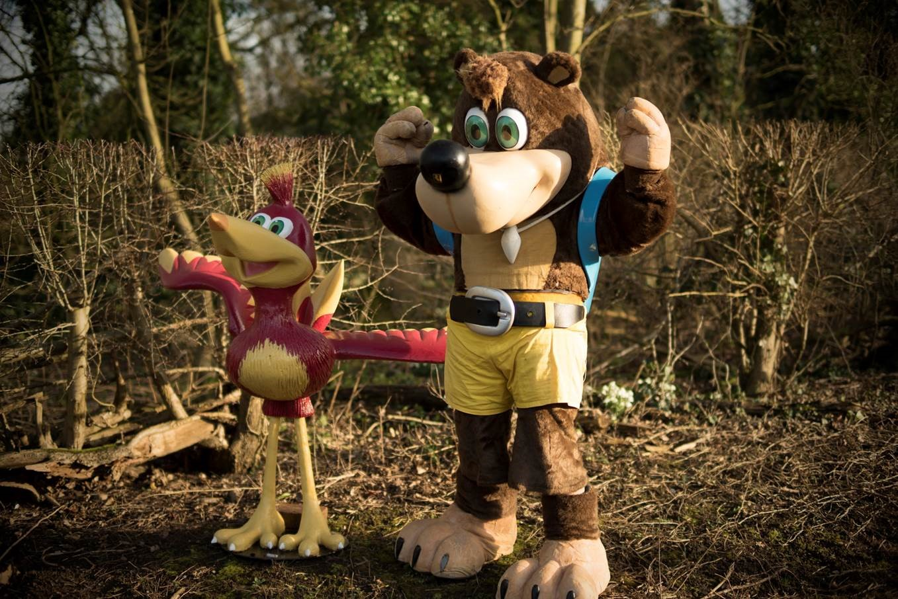

Dear Rare,

It is with a heavy heart that I pen my final correspondence to you. After a total of more than three years here, today marks my last jaunt across your picturesque landscapes.

I’ve had a ridiculous run during my time here (and more generally within Microsoft if you include a brief soiree at Lionhead) I’ve played a part in shipping five games: _Kinect Sports: Season Two, Kinect Sports Gems, Fable: The Journey, Kinect Sports Rivals_ and _Rare Replay_. That’s ludicrous. It has more to do with fortunate timing than anything else, of course. But it has still been amazing. And I haven’t even mentioned the blast I had working with the _Sea of Thieves_ team to take that idea from whiteboard-bound to full-fledged, fun-as-you-like playable prototype; helping to pave the way for the stunning world that people got a first glimpse of at E3.

Those of you that know anything about me likely know that I’m a colossal Banjo fanboy. Professional decorum probably should have dictated that I be a little more restrained about it, but that’s not really my style. As much as I’m here today because of supportive friends and family, lots of hard work, and all that guff, I’m also here because of Banjo. Not just here at Rare, but here in this profession, in this world. Because it’s here that the spiraling mountains and clantankerous caverns of the fantastical intersect with the ~~desert~~ rolling green fields of the real.

If you love Rare so much, why don’t you ~~marry it~~ not leave?

This was not an easy decision nor one that I came to lightly. I genuinely love this place and it was never _just_ a job for me. When I came back after finishing University I rented a cottage that’s a five minute walk away and I (you may have noticed…) walk around barefoot all year round. Basically, I made myself at home. And Rare embraced that (or, at least, no-one ever got up the nerve to tell me to put some damn shoes on). Gregg mentioned in the 6-hour Twitch marathon last week that the thing he looks for in a Rare employee is something a little bit different, a quirk. The kind of thing that might make some employers think twice about hiring a person in the first place.

I totally agree. I think _that’s_ the key. That’s where the magic comes from. It’s those idiosyncrasies that give rise to games where you guide a pair of snakes up a mountain to reach the moon, or tend to a garden full of anthropomorphic piñatas, or, indeed, stuff a breegull in a bear’s rucksack in the name of gameplay. I’m a big believer in the power of “[combinatorial creativity](http://www.brainpickings.org/2011/08/01/networked-knowledge-combinatorial-creativity/)” – the notion that creativity is somewhat like LEGO, and innovation comes from putting together pieces from as wide an array of sources as you can find. And quite often the pairings that seem the least likely to go together create the most interesting results.

That’s, I think, why incubation teams like Rare Labs are so valuable, and why game development is so rewarding generally. It’s the massive, cross-discipline – art, design, software engineering, and so on – effort required to make a game possible that also fuels the potential for massive innovation and creativity. And it’s why we would all benefit from having more women in games, and more people with diverse backgrounds all up. Because the more experiences, viewpoints and idiosyncrasies we can get into that ~~melting pot~~ witch’s cauldron, the better and more interesting the games that come out will be.

Rare’s in a really great place to push for more of that moving forward. Having a workgroup dedicated to improving diversity, encouraging people from all disciplines to reach out of their comfort zones and try new things, and recognizing that good ideas can come from anywhere. The last two come from everyone having great faith in everyone else. It’s that faith that has made _Rare Replay_ such a great project to work on. I’ve been given so many opportunities to define not just my role but the game as a whole, and that’s been intensely rewarding. I’ve probably seen enough assembly code to last me a lifetime, but I’ve loved every minute of it. I know I’ll never work on another project quite like it.

As sad as I am to be leaving, in some ways _Rare Replay_ feels like the perfect swan song to exit on. A celebration of over 30 years of gaming history from one of the companies that defined my childhood (and adulthood). Including some of my favourite games of all time, but also some lesser-known (to me) gems that I was happy to discover (and get more intimate with than perhaps any developer since the original authors!) I’ve got an exciting new adventure coming up that I look forward to giving my all, just as I’ve given Rare my all for over three years, but this place will always have a special place in my heart. The same heart that was lurking in a 9-year-old boy unwrapping a copy of Banjo-Kazooie in Christmas of 1998, with no inkling this is where he’d be 17 years later.

This was a dream job in more ways than one. _Diddy Kong Racing_ was the first game I ever owned, and my first role at Rare involved working with a third of the original programming team, John Pegg. I’ve experienced Chris Sutherland yelling “COMBO BREAKER” after hours in Barn D. I shared a home with _DKC_-alum Brendan Gunn during my internship. _Sea of Thieves_ gave me the chance to work directly with Mr. Mayles, father of my beloved bird and bear. The list goes on. I’ve worked with so many of my heroes (fictional and non-fictional) now that I almost lose track. And it’s not just the veterans, there’s so much fresh talent roaming the halls these days that I have no doubt Rare has a very bright future ahead. It’s been a massive pleasure and honour to work with you all.

I’m sure this won’t be the last time our paths cross. Best of luck on the open sea, and please look after the place when I’m gone – I want to play _Rare Replay 2_ in 30 years time.

With love,
Karn
