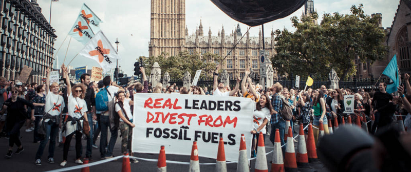

Two months ago, in late 2016, I left my job at Playtonic Games and with it my career in the (mainstream) games industry. Why did I leave behind the "dream" career I've been building for more than seven years? There were many reasons, but the key factor was so that I could focus my energies on really big, way-out-of-my-league-but-let's-try-anyway issues, such as climate change.

> It is hard to find words to capture the fact that humans are facing the most important question in their history — whether organized human life will survive in anything like the form we know — and are answering it by accelerating the race to disaster.

<cite>— Noam Chomsky, [Trump in the White House: An Interview With Noam Chomsky](http://www.truth-out.org/opinion/item/38360-trump-in-the-white-house-an-interview-with-noam-chomsky)</cite>

After 2016's seismic [political](/writing/brexit-and-beyond/) [events](https://en.wikipedia.org/wiki/Donald_Trump), [record-breaking temperatures](https://news.mongabay.com/2017/01/nasa-and-noaa-2016-hottest-recorded-year-ever/), and [wave](http://www.independent.co.uk/news/world/australasia/great-barrier-reef-climate-change-australia-coral-bleaching-environment-a7360696.html) after [wave](https://www.theguardian.com/environment/2016/oct/06/uk-fracking-given-go-ahead-as-lancashire-council-rejection-is-overturned) of terrible news for the environment, I decided to make the jump. There is no stopping climate change; it's [already happening](https://twitter.com/mark_lynas/status/823558795624411136). But we can still do our best to try and minimise its impacts. Unfortunately the impacts we're already seeing have in many ways been underappreciated because for many they still seem distant and less pressing than more immediate concerns, and notably because they're [affecting people of colour in poorer countries first and foremost](https://mediadiversified.org/2015/03/19/climate-change-is-easier-to-ignore-because-right-now-its-people-of-colour-who-suffer-the-most/). A stark reminder that this isn't just an environmental issue, it's a social issue. It's also an economic issue, a political issue, an everything issue. So where to get started? And what can a game programmer possibly do in the face of such huge crises? Well, I've been giving that some thought, and I'll start with what I know: games.

Games can be a great way to learn about and explore big complicated, [holistic systems](https://en.wikipedia.org/wiki/Systems_thinking) which are otherwise difficult to grasp in their entirety. But a solid foundation of knowledge is just the first step. If we want to fight climate change we also need to know how and where we can apply our knowledge to create meaningful solutions. In his book, [Persuasive Games](http://bogost.com/books/persuasive_games/), game designer and philosopher Ian Bogost describes how games can be used to mount and explore arguments about the "real world." Bogost calls this "procedural rhetoric", a new kind of persuasive argument "tied to the core affordances of computers: running processes and executing rule-based symbolic manipulation." The book is full of examples of games that have done this well, and not so well. It's well worth a read if you're interested in games as catalysts for change.

[Eco](https://www.strangeloopgames.com/eco/) is a online game in which players "must collaborate to build a civilization in a world where everything they do affects the environment." Need wood for building a shelter? You'll have to cut down a tree. Cut down too many trees, though, and the ecosystem(s) will suffer along with the (fully simulated) climate. Your ultimate communal goal is to build up sufficient technological advances to ward off an impending meteor impact, but you have to do so without irrevocably devastating the natural environment in the process. As well tailoring as their own behaviours to achieve this, players can form governments and [write laws](https://www.strangeloopgames.com/how-player-created-laws-work/) to, for example, restrict how much hunting of a given species is allowed, or how much pollution is acceptable.

The game, developed by [Strange Loop Games](https://www.strangeloopgames.com/), is [partly funded by the US Department of Education](http://www.prweb.com/releases/2015/06/prweb12790599.htm) and is being designed and built for use in classrooms in addition to more traditional gaming contexts. Further funding came via [Kickstarter](https://www.kickstarter.com/projects/1037798999/eco-global-survival-game) which included a tier that gave backers access to the game's source code and even offered the chance to submit code for possible inclusion in the final game. It's an interesting, semi-open-source model that's facilitated by a very open and welcoming development team. Given their unique approach (and game) I thought I'd get in touch to offer my services, I've since started pitching in with the game's development! If you're interested you can buy the game now and get immediate access to the current [alpha build.](https://www.strangeloopgames.com/eco-alpha-5-released/)
> Given that the humanitarian world vastly underutilizes the tools and resources developed by climate scientists to help predict disaster, games may help spur innovation and development of new policies and practices that incorporate use of science that seems incomprehensible at first glance.

<cite>— ClimateCenter.org, [Can games help people manage the climate risks they face?](https://www.climatecentre.org/downloads/files/Games/AW-wps-games-v5.pdf)</cite>

Veering away from games but staying within the realm of interactive media, there's a whole load of interesting environmentally-oriented projects out there right now. If you're a programmer (or otherwise technically inclined) and you want to do _something_ but you don't have a ton of free time to dedicate, you could do worse than to take a peek at the open source community. To highlight just one example..

)")

[Electricity Map](https://electricitymap.tmrow.co/) by [Tomorrow](http://www.tmrow.co/) is a gorgeous, real-time, interactive simulation of where electricity comes from (and goes) across Europe, and how much CO2 is emitted in the process. It's part of Tomorrow's goal to "propel humanity to a sustainable state of existence by quantifying, and making widely accessible, the impact of every choice we make." It's fully open source and you can see how to contribute [over here](https://github.com/corradio/electricitymap#contribute). I'm hoping to chip in myself (I've only committed a minor documentation amendment so far, but hey, baby steps, right?) and the team is super helpful, friendly, and knowledgeable. I'm learning loads just by hanging out on their [Slack channels](http://slack.tmrow.co/).

And while we're on the subject of learning, there's now a wide array of relevant and free online courses out there if you want to delve in deeper before starting to (help) build things. [Coursera](https://www.coursera.org/)‘s [Intro to Sustainability](https://www.coursera.org/learn/sustainability) takes a (fairly academic) introductory look at "how today's human societies can endure in the face of global change, ecosystem degradation and resource limitations." It's a nice jumping-off point for several areas of study across both the natural and social sciences.

Coursera also offers two really great and tightly coupled coursers on global warming. [The first](https://www.coursera.org/learn/global-warming) describes the science behind global warming and how its effects can be modelled procedurally, while [the second](https://www.coursera.org/learn/global-warming-model) lets you actually put that knowledge into action by building your very own climate models in Python. The latter assumes no prior knowledge of Python either, and actually sells itself as "a great way to learn Python!" if you're not familiar with the language and fancy a double-whammy of learning.

The title for this post (as well as much of its contents) was inspired by Bret Victor and particularly his article, "[What can a technologist do about climate change?](http://worrydream.com/ClimateChange/)" This far-reaching piece covers everything from energy production and consumption to building new tools for scientists and engineers and beyond. The section on "[media for understanding situations](http://worrydream.com/ClimateChange/#media)" is particularly interesting, especially in light of the rise of so-called "fake news." It relates to Victor's concept of "[explorable explanations](http://worrydream.com/ExplorableExplanations/)" which is his "umbrella project for ideas that enable and encourage truly active reading."

An [active reader](https://mediactive.com/), according to Victor, is someone who "asks questions, considers alternatives, questions assumptions, and even questions the trustworthiness of the author." In an increasingly information-saturated world it is becoming ever more difficult to discern fact from fiction, but ever more [important for us all](https://www.theguardian.com/environment/2016/dec/15/trump-cabinet-climate-change-deniers) to be able to do so. Victor suggests that part of the solution should be a re-think of how information is presented. Despite technological improvements, most of the information we consume online still comes to us in the form of static text documents, just as it would in a newspaper. Perhaps we can do more?

What if documents weren't static but **reactive?** What if, rather than simply mentioning a bunch of facts and figures (and, if you're lucky, some citations), a document actually had the models behind those figures built in so that readers could play around with them? Take the following as a trivial example: If you eat cookies you will consume calories, which is % of your daily recommended intake. Try clicking and dragging the number of cookies. Now imagine similar techniques applied to mainstream media articles! [Ten Brighter Ideas](http://worrydream.com/TenBrighterIdeas/) is Victor's (incomplete) proof of concept of these ideas in terms of energy conservation.

But that's just the tip of the iceberg. If you think of it as a spectrum with static text documents at one end and sophisticated interactive content (e.g. games) at the other end, I think there's a massive opportunity to create stuff that pushes towards the latter end of that spectrum, and enable others to do so as well. And there are people out there who are already doing this in various arenas. [Vi Hart](http://vihart.com/) and [Nicky Case](http://ncase.me/) developed [Parable of the Polygons](http://ncase.me/polygons/), a "playable post" about segregation and how small individual biases can quickly create large collective ones. Nicky's other work includes an [interactive guide to alternative voting systems](http://ncase.me/ballot/) and a [game about the effect of news cycles](https://ncase.itch.io/wbwwb) and "becoming what we behold."

I think the complexities of climate change and related issues (ecosystem devastation, energy generation and consumption, etc.) would greatly benefit from more of this kind of content. And I think game developers have a particularly relevant set of skills to help make that happen. If any of my fellow game devs (not just programmers) are reading this and might be interested in collaborating on something in this area, please get in touch!

Of course games, web apps, and fancy interactive thingymajigs are not a magic silver bullet for saving the planet. An issue like climate change requires a myriad of different responses, and another essential one is good ol' collective political action. That's something we can all get involved with, game programmer credentials or no. With that mind I'm excited to have joined the [Divest Parliament](https://gofossilfree.org/uk/divest-parliament/) campaign team with an aim to convince our MPs to divest (remove and replace) all fossil fuel investments from their £500 million Parliamentary Pension Fund. I've just come back from a fantastic training weekend in London, and we have some big plans for the months ahead.

The campaign's belief is that our MPs should take this opportunity to show leadership on climate action by putting their money where their mouths are. Divestment from fossil fuels is the fastest growing divestment movement of all time, with over [$5 trillion already committed](https://gofossilfree.org/commitments/) to be divested globally. Just a few days ago the Irish parliament passed first-of-its-kind [fossil fuel divestment legislation](https://gofossilfree.org/uk/ireland-passes-fossil-fuel-divestment-bill/). "If it's wrong to wreck the planet, then it's wrong to profit from that wreckage" as [Bill McKibben and Kumi Naidoo say](https://gofossilfree.org/uk/do-the-math-fossil-fuel-investments-add-up-to-climate-chaos/). Divest Parliament is a national campaign and we need people from every area of the UK to get involved. It's an exciting opportunity to make a real impact, so if you think you might be interested in helping out please do get in touch!
