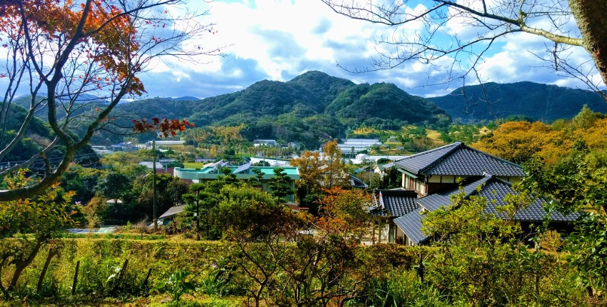

Six and a half years ago, while in my first proper games industry job as an intern at Rare, I wrote about [how to break into the games industry](/writing/how-to-break-into-the-games-industry/) based on what (seemed to have) worked for me. The gist of my advice was: be really passionate about what you do, create lots of stuff (especially in your spare time), go to university (probably), and get your name out there with a website, portfolio, etc.

So far, so typical. And not necessarily _bad_ advice (although potentially damaging, which I'll get to in a bit), but at the very least incomplete. Only part of the picture.

Fast forward to the present day: I [left my full-time game development job](/writing/game-programmer-vs-climate-crisis/) to “fight climate change”, and for the past four months I've been living in Japan, exploring the country while also working on [personal projects](https://karnbianco.itch.io/plantasia), including climate change game ideas, and collaborating on an upcoming [indie game](http://lostwordsgame.com/).

A friend recently remarked that it must be nice choosing what you want to work on, how the heck are you managing that (paraphrasing slightly). It got me thinking about that old blog post, how my thoughts and situation have changed, and what I might say, to myself then and others now, about making games for a living.

### Are You Feeling Lucky?

I want to start by emphasizing just how lucky I was with my initial break into the industry, and the many other opportunities I've had since. Yes, I've worked hard and honed my craft, but how many others do just that and _don't_ land their dream job before they've even graduated? [Survivorship bias](https://en.wikipedia.org/wiki/Survivorship_bias) is a wily beast and it can be particularly compelling when you're the one who survived.

Likewise, the [myth of the perfect meritocracy](https://www.vox.com/conversations/2016/11/22/13652860/income-inequality-meritocracy-robert-frank-success-luck-ethics) is just that: a myth. A nice story that paints a picture of a world where everyone gets what they deserve. If you just put in the work, maintain a positive attitude, and keep on plugging away you can have everything you've ever wanted. And those that don't have it all? Well, they're probably just lazy and didn't want it enough in the first place.

Poppycock! The world of games was always a world built for me: the young, geeky, straight, white, cisgender male who grew up playing games. There are barriers to entry for others that I hadn't even considered might exist, let alone that they might be giving me an advantage I couldn't see. I never had to prove that I belonged as a player or a developer. [Not everyone is so lucky](https://mashable.com/2018/01/09/video-game-diversity/#ei.F.nfIhOqM).

Similarly, access to higher education, which I relied on in order to get my first internship, is [not distributed equally](https://www.theguardian.com/higher-education-network/2017/oct/24/how-can-all-university-students-get-a-share-of-the-spoils). I was raised by a single mother in a below the poverty line household, but thanks to loans and income-based bursaries, not to mention a lack of other responsibilities and roadblocks, I always had the option to go to University if I wanted. Not everyone is so lucky.

### The Limits (and Exploitation) of Passion

While I was at university I spent a _lot_ of time working and studying. I loved what I was doing and I was driven by a passion for learning and creating. That set me up nicely for the industry's crunch (unpaid overtime) culture which I didn't hesitate to dive into head-first. I mean, I was finally making games for a living! Why wouldn't I want to spend every waking hour at work?

At one stage my manager actually told me to _work less,_ lest I burn out. (Burn out? Pfft!) I'm grateful to have worked with amazing and kind people like that. But it still remains the case that the industry at large has some very unhealthy attitudes towards work. And even if you're not literally being forced to work extra hours, the unspoken peer pressure to do so can be crushingly strong.

My thoughts on crunch have changed a lot since I started. On my last project I made a point of going home at 5pm every day, even when my teammates were regularly staying into the evening. It wasn't always easy, but at least I had that luxury. Not everyone does. I've also become increasingly wary of phrases like “passion-driven” and “can-do attitude” which so often seem to translate into “happy and willing to work as many hours as we deem necessary, uncompensated, to get the job done, without complaint.”

Exploitation of passion [isn't unique](https://twitter.com/tigerkite/status/972547058862346241) to the games industry, but it's particularly widespread here. Overwork is often driven by the developers themselves, not just some overbearing management team, but that doesn't make it any less damaging. It can be hard to recognise how much is too much when you're enjoying yourself, but we all have limits and it will catch up with you eventually (take it from me). Also, the desire for a healthy work-life balance doesn't mean you're less passionate than your peers or any less deserving of your place among them.

In my experience it _is_ possible to work in games on a (mostly) 9-5 schedule, but you have to be very clear that that's what you want. You also have to work at company with at least a vaguely healthy attitude towards work-life balance (easier said than done, sometimes). And you may have to ostracise yourself somewhat from your teammates in the process, unfortunately.

### There's More To Life Than Making Games

There is more to life than work, even the privileged work of making games. But in a passion-driven profession like this one it's easy to feel like you're a failure if you're not _constantly_ working or learning or improving in some way, at work and on your own time. You've got (or you're on your way to getting) your dream job after all! You should be grateful (true) and just put up with any downsides along the way (false).

> If you're able to take time off for the holidays, it's ok to do nothing. You don't have to have a side project. You don't need to get ahead on work. Your portfolio might be important for you career, but so is rest, perspective and self-care.

<cite>— [Innes McKendrick](https://twitter.com/innesmck/status/944625783397642241?lang=en)</cite>

Even if you enter the industry, as I did, with a laser-focus on making games above all else, priorities can change. For me, I found myself increasingly drawn to environmental, social and political activism. Big issues that extended beyond just _my_ success and _my_ happiness, which is ultimately (I realised in hindsight) what I had been focusing on throughout University especially.

Relationships and family commitments can, of course, also be big priority shifters. But it could be anything, or nothing! Just a desire for a healthier balance of the different elements of your life. You might even go through phases — the thrill of starting or finishing a project can be a particularly attractive time to “just do a bit more before I go home” but balance is really key if you want to be in it for the long haul.

I would advise just being mindful of how you spend your time and prioritise self-care and care for those around you as seriously as you might prioritize productivity at work and your career development. Game development culture (or indeed most corporate culture) doesn't always lend itself to encouraging that way of thinking, so it might be something you have to make a conscious effort to practise.

And that's just to talk of those who have a choice in the matter. There are plenty of people — those on low incomes, those who have families to support or other commitments, etc. — for whom being the model employee that, as proof of passion and commitment, is always doing overtime or working on side projects, just isn't feasible. And I hope the industry is starting to recognise how many brilliant people we lose when our model of success remains so narrow and alienating.

So how did all that bring me to making climate games and travelling the world? Well, it started with a gradual readjustment of my attachment to being “passionate” about making games. What did that mean to me? What was I sacrificing in the name of that passion? I was (mostly) having fun, but what other aspects of my life were suffering? Ultimately, I decided to leave full-time work to make room for activism and extended travel. And I was extremely privileged to be able to make that decision.

Being raised in a low-income household had a big impact on my relationship with money. Crucially, my mum was always very open about our financial issues while I was growing up. She made no attempt to hide the fact we were struggling to pay bills, that she was often working unpleasant, low-paid jobs to make ends meet. She made me appreciate what scraping by and never having _quite_ enough really meant, and the toll that takes. And I've carried that with me. It's a big part of why I pursued the pie-in-the-sky idea of doing a job I love so intently in the first place.

It's also why I've been saving money since I was a teenager doing part-time work at a second hand clothes shop, and why I had the safety net that allowed me to do the whole “quit my job and travel the world” thing. But, again, I was intensely privileged to be _able_ to save like that. No-one has ever been financially dependant on me, I live in a country with free healthcare, the list goes on. My journey is not a recipe for success and it's not a justification to attack anyone who's _not_ travelling the world or pursuing their dreams as some lazy, spoilt, ungrateful, [avocado toast-eating](https://www.washingtonpost.com/news/food/wp/2017/05/15/dont-mess-with-millennials-avocado-toast-the-internet-fires-back-at-a-millionaire/?utm_term=.cce1d5dadd01) brat.

I still love making games and strongly believe that they have a lot of untapped potential for improving people's lives and helping solve real problems. As well as, y'know, just being good fun, which is also important sometimes. I'm extremely grateful for being able to do what I do. And that's another part of why I quit my day job so I can try and give something back after receiving so much. If you're interested in making games – especially if you're interested in games for change and/or you have a voice that is under-represented in the games industry, please feel free to reach out if I can help in any way. 🙂
