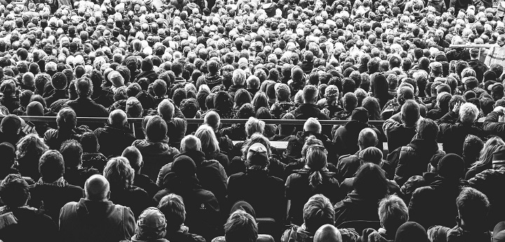
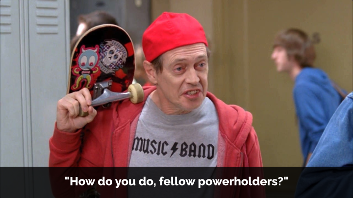
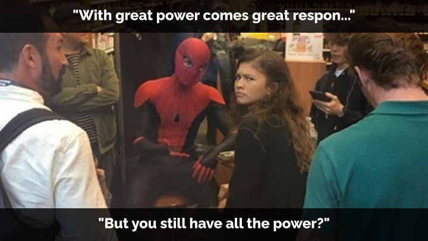
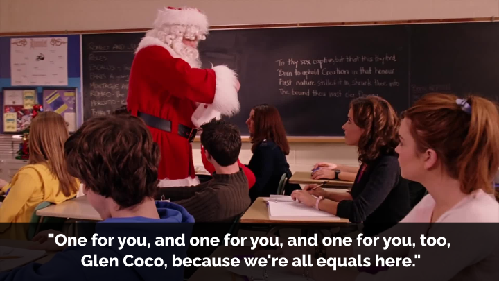

## New power vs. old power

What do Facebook, Airbnb, Black Lives Matter, the Occupy movement, Donald Trump, and ISIS all have in common? They all leverage "new power".

That's according to [New Power](https://thisisnewpower.com/), a 2018 book by Jeremy Heimans (an ex-McKinsey consultant turned activist) and Henry Timms (now the CEO of a [major PR company](https://www.brunswickgroup.com/our-experts/henry-timms/)), which was [endorsed](https://thisisnewpower.com/endorsements/) by everyone from the co-founder of Black Lives Matter and Jane Goodall, to Richard Branson and the CEO of Unilever.

At the core of the book are the twin concepts of "old power" and "new power":

> Old power works like a currency. It is held by few. Once gained, it is jealously guarded, and the powerful have a substantial store of it to spend. It is closed, inaccessible, and leader-driven. It downloads, and it captures.
> 
> New power operates differently, like a current. It is made by many. It is open, participatory, and peer-driven. It uploads, and it distributes. Like water or electricity, it’s most forceful when it surges. The goal with new power is not to hoard it but to channel it.

At first glance, this looks like a typical distinction between top-down, hierarchical, authority-based power, and bottom-up, distributed, autonomous power. The book's promise to unpack how power works in the 21st century and how to "make it work for you" led me to expect an exploration of different ways that "old power" is being dismantled, distributed, and turned into "new power".

But what I found in *New Power* was an argument for a particular set of social arrangements, built on specific ideological assumptions that end up doing, in my view, as much to prop up existing power as they do to tear it down.

## Everything old is new again

Participatory organisations aren't new, so what *is* new about "new power"? Technology, for one. Digital platforms, such as social media, are key to a "new power community":

> Any new power community has three key actors—its participants, its super-participants, and the owner or stewards of **the platform**. *(Emphasis mine)*

While acknowledging that all technologies are "vulnerable to co-optation and capture", the book is fairly techno-optimistic (including a wee bit of blockchain hype, as was the style at the time). It presents technology as a (if not *the*) driving force behind many recent social phenomena. This view goes hand-in-hand with an interpretation of history which claims not only that "the twentieth century was built from the top down" but that "many of us were relatively content to play a minor role in a larger process."

This conception of people prior to the 21st century as largely passive or uncritical of their conditions necessarily erases or downplays the countless examples of workplace and community organising to resist, change, or overthrow unjust systems. Little consideration is given to the role that oppression and coercion play(ed) in preventing people from demanding their "right to participate" at work, in politics, and elsewhere.

Instead, the onus is on new social norms, driven not just by technology but by a generational shift. Young workers today are described as being part of the "trophy generation" for whom participation was valued over performance. This, combined with the dopamine highs granted by instant feedback and validation on social media has created a generation of workers who now also expect meaningful praise, feedback, and participation at work.

No real evidence for these claims is given; they're presented as neutral observations. Shifts in power dynamics in this framework boil down to a mostly apolitical, inevitable result of external forces. Workers aren't agitating and organising for better conditions because they're fed up of being exploited and alienated but — to put it a little more crudely than the book does — because the thrill of getting "likes" on Facebook got them hooked on real-time feedback loops, and now they want those at work, too.

The book does briefly concede that "it will be critical to actually reduce wealth and income inequality and change material conditions" but doesn't go into detail about how that might be done, instead focusing on the "subtler challenge" of "how we create more meaningful opportunities for people to actively shape their lives and connect with the institutions that shape them". That sounds admirable enough, but the details are key: who does the "we" refer to, who actually has agency, and what does it mean to "shape" an institution?

## Crowds vs. communities

"The crowd" is at the heart of *New Power*, and while it's never given a precise definition, the picture that emerges throughout the book is not just that of a large group of people, but of a force that can be "channelled" to specific ends.

> As any seasoned movement builder can tell you, the greatest viral successes and most impactful moments usually come after months and years of consistent investment in **your crowd**. *(emphasis mine)*

The crowd is positioned as some*thing* that can (and should) be owned, or at least stewarded, shaped, and directed by actors *outside* the crowd; organisers, movement builders, bosses, leaders. Social organisation is conceived of as a design challenge in which leaders should focus on "delivering a killer user experience, sticky feedback loops, and a compelling set of incentives" to motivate the crowd / masses to act. 

To be fair, the book explicitly warns that "the crowd cannot be seen as an asset to be strip-mined" nor as "a distant, amorphous asset—a blurry mass of occasional opportunity". Yet despite repeatedly proclaiming that "it's only a movement if it moves without you", the book puts very little faith in the ability of "crowds" (that is, people) to self-organise or collectively lead themselves, relying instead on a select few to best make use of "their" crowd, which they can "blend into" and out of as needed.

> When [Ai-jen Poo, founder of the National Domestic Workers Union] was in her twenties, there were fierce debates as to whether she, who had never been a domestic worker, could legitimately represent the interests of domestic workers and lead their movement.
> 
> Poo’s unique position demands that she be extra-conscious of issues around status and signal in a way that shows she is truly investing in her crowd. **To lead *her crowd* effectively, she has to constantly demonstrate how she can blend into it.** *(Emphasis mine)*

Although crowds are described as "communities", many of them struck me as more closely resembling the hierarchies that emerge under the "managerialism and institutionalism" of "old power", albeit with at least a pretence of greater power distribution *within* those structures. This isn't so much a contradiction as it is a core part of *New Power's* thesis: the intention was never for "new power" to supplant "old power", but to find ways to "blend" the two together.

This intention follows from *New Power's* focus on ends over means, building on a definition of power as an "ability to produce intended effects" (citing Bertrand Russel). The focus isn't on distributing power because that's a valuable goal in and of itself, but because it's seen as the most "effective" way to achieve other goals. Goals chosen, in most cases, not by "the crowd" but by a few leaders.

I don't mean to downplay the importance of efficacy, nor to quibble over finding the "correct" way to get things done; we should absolutely strive to understand and learn from what has and hasn't worked before. But without a foundational commitment to distributing power as an inherently worthwhile goal — one of many — I found the book coming to some questionable conclusions.

## Old power in new clothes

*New Power's* broadly amoral approach to power allows it to seamlessly swap between examples in politics, activism, and plain old capitalist business. The #MeToo movement is cited right alongside case studies about General Electric "blurring the line between the crowd and the corporation" and BrewDog "revolutionizing" the beer industry through deeper engagement with customers, but with no further interrogation of the design and structure of these businesses.

That some see "great commercial potential" in "new power" is treated neutrally, as just another example of how impactful it can be. Airbnb's ability to "rally its hosts as a way of fighting back against city governments" is presented as an impressive feat, with no space given to consider *why* city governments (and local residents) might want a say in [how Airbnb operates in their communities.](https://www.bbc.co.uk/travel/article/20240701-what-does-a-world-without-airbnb-look-like)

The assumption that what's good for a company's bottom line can also be good for creating lasting social and political change strikes me as self-limiting at best, and reactionary at worst. While the book is written from a mostly liberal / centrist political perspective — it speaks favourably about the Obama campaign, and unfavourably about Trump and certain Republicans — it mostly sells itself as an "apolitical" project.

There's no specific criticism of big business or capitalism here. Corporations that rely too much on "old power" aren't bad or oppressive, they're just behind the times. Most will *want* to embrace "new power" because that's just where things are headed. It'll be profitable, too! No need for worker organising and agitation, no need to fundamentally challenge the dynamics of market capitalism; we can find solutions that work for everyone, bosses and workers alike, in *this* system, by "blending power".

In several examples, "new power" dynamics are directly shown to *solidify* unequal power dynamics that already exist, for instance through reliance on volunteer and unpaid labour:

> Rogers sees giving royalties only to the most important contributors as the best long-term path to sharing value; he feels that **a more transactional model in which every contribution is paid for would tarnish the spirit of cooperation and volunteerism** that binds the community together. *(Emphasis mine)*

"New power" isn't a *threat* to entrenched power, it's an *offering*.

To be sure, the book does warn about "the ways new power tools are unexpectedly being used to strengthen and reinforce leaders with deeply old power values", but the proposed solution isn't to re-examine "new power" or challenge "old power". Rather, we're invited to become (or, for most of us, to follow) leaders who can "shift between old and new power as situation and strategy demands", to "toggle between 'movement' and 'institution,' to know when to control and when to release control".

But if someone can, at will, reassert control over the majority's "ability to produce intended effects", did power ever *really* leave their hands? If having a voice and capacity to act relies on the goodwill of a few authority figures, then isn't that still *their* power? How robust is such power if it can be revoked the moment an authority figure has a change of heart, or gets replaced by someone less willing to share their power around? Aren't these questions at least worth asking?

## Beware too much of a good thing

Despite using the language of empowerment, many examples in *New Power* still rely on making appeals to those in positions of power to do the right thing, rather than building collective capacity to take action directly. Viral online movements aimed at urging celebrities or politicians to act, for instance. Distributing power is just one of many design options. The primary goal is to make people "feel" more powerful (and therefore committed) rather than actually *become* more powerful.

Part of this stems from the notion that *too* much self-organisation (which is paired and contrasted with the "timeless traditions and discipline of good organizing") can be dangerous. The book equates bottom-up power with "informal" structures and governance. Taken to the extreme, it warns, this might even lead to "those Silicon Valley–led dreams of floating island paradises, 'an opt-in society, outside the US, run by technology." A common critique of the Occupy movement for being too focused on finding consensus appears as another warning.

> **Occupy took an extreme stance on who calls the shots: namely, everyone**. And it ultimately cost them. *(Emphasis mine)*

Experienced leaders and stewards can surely play useful roles in many organisations, but *New Power* gives no attention to *how* these roles might be created and filled. Is it first come first served? Are we back to following whoever is the most charismatic or outspoken (a flaw of "old power" as the book notes)? Is it those with the most experience? Are they elected? Does the position rotate on a time-limited basis? Are they recallable? What authority do they have, if any? Who grants them that authority? Who can strip it from them, if anyone?

Within the context of a traditional businesses the answer is clearly "whoever already had institutional power and thought this 'new power' stuff was a good idea", but what about grassroots social movements? The book never really provides answers.

This is one drawback, among many, of treating a social movement like a business, and vice versa. The limits of imagination enforced by the latter become constraints for the former. This is the best a traditional business can do without looking more deeply at its foundations, including how its owned and funded. But that would be beyond the scope and ambition of the book, so we're left with business-approved solutions slapped onto grassroots social movements.

## What if we *actually* distributed power?

Building organisations and communities that genuinely center autonomy and consensus-making is undoubtedly challenging work. "How might we co-create radically inclusive, non-hierarchical structures that don't get stuck in endless debates and inaction?" is a question worth exploring! But "let's just keep some 'old power' structures in place so they can step in and take control when needed" doesn't strike me as a very inspiring answer. Can't we be more imaginative?

I would have liked to see examples of *other* successful organisational structures, especially those that don't rely on hierarchical authority. There are many things we can learn from the likes of the Occupy movement, and the book fairly notes that a common issue for many social movements is failing to maintain momentum after big, flashy protests and mobilisations are over. But these observations are coupled with an implication that the best or even *only* solution is "blending old and new power", often in a way that leaves room for co-optation down the line.

A lack of hierarchy and authority doesn't automatically imply a lack of structure. Quite the contrary! There are a myriad of ways that humans can organise themselves, many already known, many yet to be imagined. These can be loosely or tightly structured, but neither *necessarily* requires any one individual to have control or authority over anyone else. *New Power* fails to consider alternatives perhaps in part because it takes for granted that existing hierarchical structures, such as capitalist enterprises and nation states, will continue to endure in much the same form, but with "new power" tweaks at the margins.

For instance, while speculating about a hypothetical, overly-decentralized town that crowdfunds its infrastructure spending, *New Power* worries that only the most attention-grabbing projects would get funded, leaving the "deeply unsexy project to smooth out the gravel on the local highway" neglected. Better to have a centralized bureaucracy after all, if we want to avoid such traps. Yet, doesn't this problem only exist *because* we assume that a central authority needs to exist in order to facilitate the crowdfunder and carry out the work? If communities were instead *directly* empowered, wouldn't locals who suffer from driving on crappy roads be motivated to come together and fix the problem themselves, however "unsexy" it is, without having to "sell" anyone on the idea first?

Crowdfunding shows up as an example of "new power" several times, including as a warning about the limits of participatory power. "More bosses do not, in fact, mean more or better governance" the book laments about a Kickstarter campaign gone awry. But crowdfunding backers aren't "bosses" in any real sense; their limited power is offered (and can be revoked) by whoever is running the campaign. In crowdfunding, "more participation does not necessarily lead to more equal representation or inclusion; sometimes new power can mean less of both", the book warns, but isn't this precisely because such "new power" was never *really* distributive in the first place?

## Closing thoughts

*New Power* felt to me as though it had been written for managers, bosses and those who already benefit from "old power". It doesn't set out to ruffle any feathers, but rather to gently convince powerholders of the benefits of *choosing* to share *some* of their power, while keeping their privileged positions. "New power" is presented as "win-win" for political movements and corporations alike; channelling the power of the crowd will improve your public image, make you more money, and make people "feel" more powerful (even if that power is conditional and revocable).

On the other hand, *New Power* did *not* feel like a book that was written for people (like me) who are interested in more autonomous forms of organising which empower people directly, without assuming that they need to be shepherded — even if it is less frequently and more openly than our current systems — by an enlightened few, by "those on the side of the angels" as the book refers to them. That would require a very different approach to power and the ways in which specific power relations are embedded in specific social structures.

Ultimately, *New Power* reads like a business book first (Richard Branson's "[new favourite business book](https://www.cnbc.com/2018/04/23/richard-branson-shares-his-new-favorite-business-book.html)" back in 2018, no less) and a book about social change second, but I don't think these two realms are (nor should be) as interchangeable as the book portrays. Much of the analysis regarding how "new power" is already being used to shape the world around us is astute enough, but I found the conclusions about what we should learn from that, and how we should think of power going forward, much less convincing and, ironically, quite *disempowering*, unimaginative, and paternalistic.