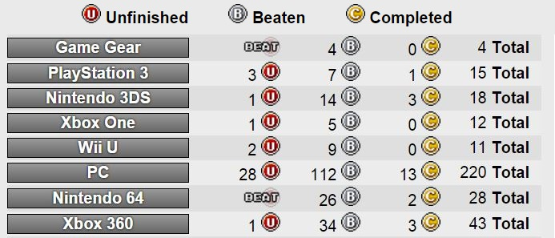

My parents were interested in gaming before I was born, so despite us all living in a relatively poor household, I was lucky enough to have enough exposure to games to spark my passion early on. But we certainly couldn’t afford to buy new games all the time. With Nintendo 64 carts at £50-80(!) a pop, one or two new games a year was a lot (although renting and borrowing from friends increased the number I could actually play).

So back then I was a completionist partly out of practicality, but also out of love for the games and a desire to explore every nook and cranny of them. As I grew older I was able to spend more money on games until the tipping point finally came and I had more money to buy games than I had time to play them (see: university, work). It seems to be a pretty common story among game developers in particular. A quintessential first world problem.

With less time (due to the other pulls of “adult” life) to spend on more games than ever before, I found my motivations and requirements for playing also shifted. Time spent playing a game needed to be justified against more criteria than just “fun”. Is it worth my time? Is it the best choice for the next game I should play? How long will it take me to play? What will I get out of it? Can I actually be bothered? Should I be playing games at all right now?

Our culture places a very high value on productivity in its various guises (economic, personal growth, etc.). So when we hear about gamification of things in the real world what’s actually being discussed is usually a very small subset of what games are about and how they can be used to motivate people to be more productive. That means the carrot-and-stick trimmings; the high scores, the badges, the collectable whatchamacallits, the XP and levels, the achievements and trophies.

Although those things don’t make a game, for some they can serve as an answer to my questions about why to play a game at all. They add a somewhat more tangible result to the experience of playing a game. Even if an achievement has no real value, it’s closer to the rules of the outside world where productivity is king and input should create output. For most people I think this is quite a subtle sensation, but for a growing number of others it is anything but.

> "I am not having fun, quite the opposite in fact, but I stick with it. Getting a score of exactly 200 meters will unlock the last 15G achievement I need in Jetpack Joyride. This is how I play video games now.
> 
> Back before I discovered achievements, I played games because I liked them. If a game was fun, I played it. If it wasn’t, I stopped. So simple."

<cite>— Cameron Gidari, [Kotaku](http://kotaku.com/achievements-have-ruined-how-i-play-games-510597650)</cite>

I had my own brush with this a few years ago. I was playing Grand Theft Auto IV and following a guide to find 200 pigeons around the city for an achievement. I often enjoy collect-a-thons (I’m a Banjo fan after all) but I wasn’t enjoying this one. Not, I think, because of the game itself but rather because my attitude was treating it like a thankless job I was being forced to do. When I got to the end of my guide I realised I had missed _one_ pigeon somewhere. I was genuinely angry. I backtracked through the list and found it but there was no positive sensation after that.

Why was I putting myself through all that for an achievement? It was utterly ridiculous. So much so that I made a decision soon after to never hunt for achievements like that again. Not because they’re inherently evil, but just because I don’t want to fall into that obsessive compulsive trap again. The notion of needing something to show for the time I invested in a game felt very wrong to me. I never needed that when I was a kid, did I really need it now? I didn’t think so. But the issue goes deeper than achievements.

> "Our play is never real play because it is almost invariably rationalized; we do it on the pretext that it is good for us, enabling us to go back to work refreshed. There is no protected situation in which we can really let ourselves go."

<cite>— Alan Watts, [The Joyous Cosmology](http://www.goodreads.com/book/show/903911.The_Joyous_Cosmology)</cite>

Calling in a proper mind now. Alan Watts was a philosopher who popularized a lot of eastern wisdom (such as Zen Buddhism) in the west. Many of his ideas are fascinating and resonate a lot with me. The basis for a lot of his ideas is the Taoist/Buddhist notion of mindfulness, or being present in the current moment. This foundation for meditation is a useful lens for examining the way we live our lives from day to day. And, as a microcosm of that, the way we play our games.

Watts wasn’t talking about games specifically, of course, but I like to think that as games become increasingly culturally acceptable they can help serve as that protected situation in which we can really let ourselves go. After all, play is still so often considered to be an occupation for children. Something that once you grow up you grow out of because you have more serious things to be attending to. But it’s just as important to adults, and as more adults play games than ever before they can help blur that line.

Game backlogs – or that ever-growing mound of untouched games that accumulates as disposable income increases but free time decreases – have become another barrier between many players and their hobby. As well as fuelling the [paradox of choice](https://www.google.co.uk/url?sa=t&rct=j&q=&esrc=s&source=web&cd=8&cad=rja&uact=8&ved=0ahUKEwjG24G2g4nLAhUEhhoKHfdaD60QtwIIPTAH&url=https%3A%2F%2Fwww.ted.com%2Ftalks%2Fbarry_schwartz_on_the_paradox_of_choice%3Flanguage%3Den&usg=AFQjCNH9BnTI86PKfHuPkI5A5EUEqoX1Tg&sig2=io1nUAwN7m5vqPlHaC3IMA), after a while those stacks become just another load of items on a to-do list that never seems to get any smaller. Where to find the time? But fear not! There are now many apps, tools, websites and self-help guides dedicated to helping you track and work through your backlog! It’s like a second job, but fun! Honest.

I’m actually doing it myself right now. I _have_ been having a lot of fun, but at first I found myself falling into bad habits. I’d start seeing a game as something to be done with ASAP so I could get to the next one. I’d spend more time talking about how many games I’d “completed” (a painfully dull subject for anyone else) rather than which games I’d been playing or why they were great. I was starting to look forward to that magical future day when my backlog would finally be cleared! How good it would feel to get there!

But those are the sorts of thoughts I’d usually associate with some dull chore I wanted over and done with. When did games become a chore? I think it’s when they became a means to some other end, and not an end in and of themselves. I found myself falling into the same trap I had with achievements – I was playing games for some external reason and not for the joy of play itself. Sometimes I thought I would be freer to play whichever games I wanted with no pressure later. But why should there be pressure now?

As with achievements, I don’t think keeping track of a backlog and “working” through it is innately negative but it does have the potential to side-line attention from (what I think is) the main event. I’d rather take thoughts like “jeez, I have so many games I’m never going to find the time to play them all”, filter it through that child who bought one or two games a year, and turn it into a “Wow, I have so many great games to play! This is _amazing_!” And when I do sit down and have a chance to play a game I want to make sure I dig right in, get involved, forget about any other games on the list, and enjoy what I’m playing there and then, otherwise what’s the point?

My goal for clearing my backlog now is to get back to that position I was in as a child, when I bought a new game because I was going to sit down and play it immediately. Not because it was on sale, or I’d fallen prey to hype train, or because I’m being greedy.

The motivations behind all this doesn’t just extend to games either. I also work in this industry because I value the day-to-day (fun, play, passion) more than the month-to-month (bigger paycheques) or year-to-year (promotions, status, etc.) I could find elsewhere. I know I’m immensely fortunate to be in a position to make that choice, and not everybody is so lucky. But it saddens me when games, something that should be about play, become work, when a much healthier transformation would be to think of work as play instead. We don’t need less play, we need more! And maybe games can help remind us of that.

Those chores I mentioned earlier? Why are those chores in the first place? Now, this is a tougher sell than “enjoy your games!” but I also try to reduce the number of chores in my life by increasing the number of opportunities for play. We all have to eat, but who can be bothered to cook properly. I often couldn’t, so this year I decided to make cooking a hobby. I’m learning how to do it properly, eating more healthily, and trying new things. I don’t always look forward to cooking, but I’m much more likely to now. Great food is the goal/result, but now I can enjoy the process too. The means – sifting, stirring, mixing, chopping, frying – can be ends too.

That’s why I’m so wary of anything that shifts focus away from play and towards external factors because – in games as in life – I think play is what it’s all about. But games are the perfect case study for such ideas because they are built on a foundation of play. I love more cerebral games like point-and-click adventure games or interactive movie-esque experiences too. But what I love most about games is that moment-to-moment joy of a finely tuned interactive experience. Where the controller becomes an extension of your hands and you can truly lose yourself in the rhythms of play.

No external motivation, no justification for playing, no rewards or goals. Just poetry in motion.