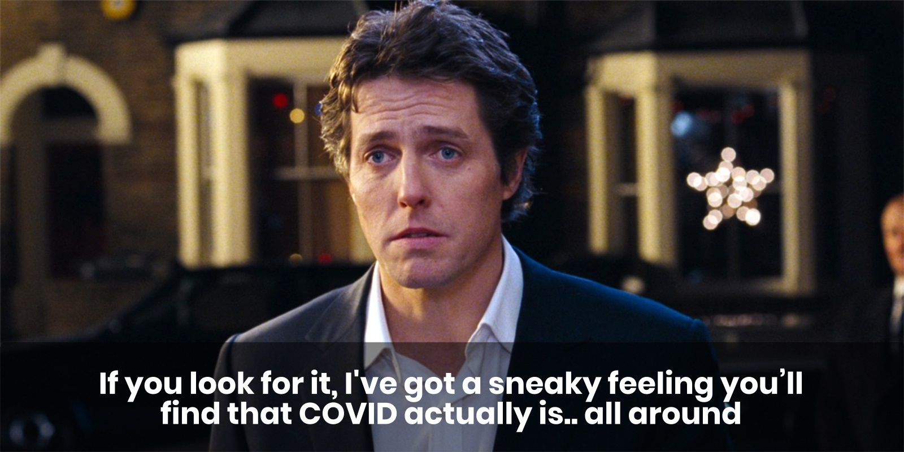
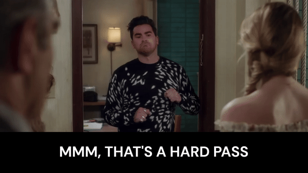
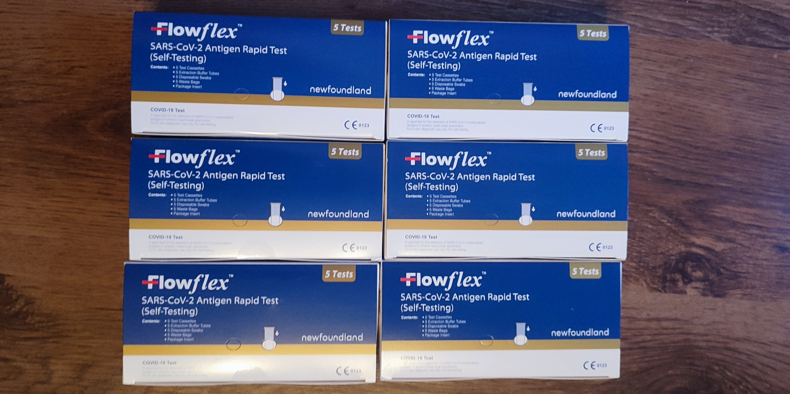

> [!info] Who is this essay for? Everyone! But especially those who are:
> 1. Interested in a summary of recent science about COVID-19.
> 2. No longer taking regular precautions (e.g. wearing a mask).
> 3. Curious about how COVID might fit into broader discussions about disability justice and collective liberation.

In May 2023, more than three years into the COVID-19 pandemic, the World Health Organisation (WHO) announced that the virus no longer met their definition of a Public Health Emergency of International Concern (PHEIC). They also noted, however, that "this does not mean the pandemic itself is over". [^1] Why is it, then, that so many of us speak and act as if we are in a "post-pandemic" era?

Is it just semantics? There is certainly some debate about what *exactly* constitutes a pandemic. An infectious disease with international, often global, reach, sure, but what of severity? Is there a threshold for number of hospitalizations? Deaths? Experts continue to debate what exactly the best technical term is for COVID in 2024, without agreement. [^2] Calling COVID a "pandemic" (or not) has always been a political choice and that much, at least, is still as as true today as it was in 2020.

Of course, most of us aren't quibbling over precise medical definitions in our day-to-day lives. A more important factor is the very real (and understandable) *desire* for the pandemic to be over, whatever name it goes by. Most people who refer to the pandemic in the past tense are clearly describing the world they (want to) live in: a world in which masking is largely a thing of the past; where actively taking precautions to minimise the risk of infection is no longer necessary.

Despite the title of this essay, then, what we *call* COVID is not actually my main interest. I want to ask more interesting questions. What does recent science actually say about COVID? What are its on-going impacts? What would it look like to truly act in line with the evidence? How can we center the needs of the most vulnerable? And what part can COVID mitigations play in the larger struggles for collective solidarity and liberation?

---

**A quick note on terminology**: For brevity this essay uses "COVID" as shorthand for "COVID-19" which is itself shorthand for "coronavirus disease 2019" (where "CO" = "corona"; "VI" = "virus"; "D" = "disease"; and "19" = 2019, the year it was identified). When referring specifically to the virus which causes COVID, "the virus" or "SARS-CoV-2" is used as shorthand for "severe acute respiratory syndrome coronavirus 2". [^3]

## Part One: The elephant in every room

COVID doesn't make headlines all that often anymore, but in many parts of the world this summer case numbers were almost as high, if not higher, than they were during the worst peaks of the early pandemic. [^4] The limited mainstream media coverage of this reality might be partly attributable to the widespread dismantling of test and trace infrastructure in many places — NHS England, for instance, discontinued their scheme back in June 2022 [^5] — which makes getting accurate circulation figures more difficult.

An alternative method for measuring the spread of COVID, which remains popular in some places due to its relatively low cost, both financially and politically, is wastewater testing; that is, testing untreated sewage after it leaves our homes and workplaces to look for samples of the virus. [^6] [^7] Wastewater testing is not without downsides; it is good at indicating general trends but the data cannot always be readily compared across regions due to methodology differences. There have been promising attempts to map wastewater test data onto infection counts, but these are not yet entirely reliable. [^8] [^9]

Despite these drawbacks, wastewater testing remains an important way to track COVID circulation, especially in places where other testing has been dismantled. Many places in the United States still do this and make [the data available online](https://data.wastewaterscan.org/?charts=CjIQACABSABaBk4gR2VuZXIKMjAyNC0wNC0yOXIKMjAyNC0wNi0xMIoBBjkyNmIxZsABAQ%3D%3D&selectedChartId=926b1f). Here in the UK, England and Wales unfortunately stopped in 2022 and 2023, respectively, while Scotland has continued. [^10] Open access data is published on the [Public Health Scotland Dashboard](https://scotland.shinyapps.io/phs-respiratory-covid-19/) from which we can spot noticeable trends, such as the massive spike in circulation that took place this summer (2024). [^11]

<iframe class="height-synced-iframe" src="/explorables/covid-wastewater-scotland/" name="Scotland COVID Wastewater" frameborder="0" scrolling="no"></iframe>

Unlike seasonal viruses such as the flu, which tend to spike in the winter months, SARS-CoV-2 (the virus which causes COVID) is an "all-year-round virus" that spikes throughout the year. [^12] Vaccines can help prevent severe infection, but they don't fully prevent transmission. [^13] Asymptomatic infections can still leave you contagious, meaning you can spread the virus without knowing it. [^14] And rapid tests are individually unreliable — false positives are very rare, but a single negative test may be as low as 30% accurate — unless you're taking multiple tests over multiple days. [^15]

> Prof Danny Altmann, an immunologist at Imperial College London, said those working in the field were perplexed by the current attitude to the battle against COVID, as the latest figures showed an increase in hospital admissions.
>
> "Clearly, there is behavioural polarisation between those who are worried by this and look for mitigation, and those who think we must learn live with it and paid too high a price for our earlier measures," he said.

<cite>— [COVID on the rise as experts say England has ‘capitulated’ to the virus](https://www.theguardian.com/world/2024/sep/26/covid-on-the-rise-as-experts-say-england-has-capitulated-to-the-virus) [^16]</cite>

A common response to all this is that infection levels don't really matter anymore, right? What matters are deaths and hospitalizations, which have generally decreased. Vaccines exist now, too, so it makes sense to "get back to normal", doesn't it?

### People are still dying

The number of deaths caused directly by COVID is thankfully much lower now than during the early days of the pandemic, due in large part to the proliferation of vaccines, but thousands of people still die every week. [^17] Moreover, if we look at "excess mortality" — which includes indirect impacts of the virus that would not have occurred in its absence — the picture is far bleaker.

The graph below shows the results of a model developed by [The Economist](https://www.economist.com/graphic-detail/coronavirus-excess-deaths-tracker) to estimate "excess deaths" globally. Strikingly, while confirmed deaths began to "plateau" in 2022, excess death estimates have continued to climb steadily. In April 2022, confirmed deaths were at 6.2 million, climbing to just over 7 million by June 2024. Meanwhile, the *lowest* estimate for excess deaths during this period went from 14 million to over 19 million, two to three times higher than the confirmed death count. The *upper* estimates went from 23 to 36 million, a four to five times difference. [^18]

<iframe class="height-synced-iframe" src="/explorables/covid-excess-deaths/" name="Excess COVID Deaths" frameborder="0" scrolling="no"></iframe>

By this model's most conservative estimate, then, more than 5 million "excess deaths" occurred between mid-2022 and mid-2024. For many people the pandemic "ended" before this, though. Let's take so-called "[freedom day](https://www.bbc.co.uk/news/uk-57643063)" in the UK — July 19th, 2021 — when lockdowns and mask requirements ended, as an example. Confirmed deaths were at just over 4 million, with excess deaths estimated between 8.5 and 13.5 million. Based on this milestone, nearly half of confirmed global deaths have occurred during the so-called "post-pandemic" era, and as many as two thirds of "excess deaths".

This comparison is not entirely fair, of course, because the "post-pandemic" era in question covers a 35 month period, while the "pandemic" era sits at a fixed 20 months. Even if we account for this and compare just the 20 months before and after July 2021, we still find that over 40% of confirmed deaths and 50-60% of estimated excess deaths occurred after we (or, at least, government officials here in the UK) had already declared the pandemic to be over.

The large range between upper and lower bounds for excess death estimates reflects the difficulty of trying to accurately measure impacts at a global scale. Quality, quantity and consistency of available data, as well as methodology for generating them, varies greatly between regions. There is a great deal of room for error in such models, which we should be mindful of. Still, the broad picture we have available to us certainly calls into question the notion that reduced risk to life and health was truly the primary driver for "getting back to normal" in 2021/2022.

We can celebrate the overall reduction in confirmed deaths while also rejecting the eugenicist logic which claims that the continued deaths of *some* people, usually the most vulnerable among us, is just the price we have to pay to get on with our lives. Not only because this rhetoric should always be challenged on its own terms, but because we *all* vulnerable now.

### We are all vulnerable

")

COVID is not "just like a cold or the flu"; it may not even be accurate to think of it as a respiratory disease at all. Although it enters the body through the respiratory system just as the flu does, SARS-CoV-2 enters our cells by binding to the ACE2 receptor, which is present in *all* blood vessels, and most organs. This fact, alongside wide-ranging, non-respiratory symptoms, has led some researchers to describe COVID as a vascular disease, [^19] while others have noted that non-respiratory symptoms may instead be the result of inflammation caused by the immune system fighting the virus, rather than by the virus itself. [^20]

Whatever the precise mechanisms at play, what we know for certain is that COVID doesn't just impact the respiratory system (lungs, throat, nose, etc.) but can impact and damage almost every organ in the body, including the liver, kidneys, brain, and heart. We now have ample evidence that COVID can cause: brain damage; [^21][^22] heart attacks, strokes and blood clots; [^23] immune system damage; [^24] increased cancer risk; [^25] gut and digestive diseases; [^26] and more besides.

While it's true that some people — such as those with autoimmune issues — are *more* vulnerable than others, in truth we are *all* vulnerable to these impacts, to varying degrees. Studies have shown that natural immunity after a COVID infection can be very short-lived, meaning you can get re-infected within months, weeks or even days. [^27] Vaccines offer more substantial protection, but this protection also wanes "significantly" within 3-6 months. [^28] If you haven't received an updated vaccine in a while, you may not have much more protection (from certain longer term impacts) now than you did at the start of the pandemic.

In fact, if you've had several COVID infections (including asymptomatic infections you may not have noticed), you might be *more* vulnerable to long-term impacts than you've ever been. This might sound hyperbolic or counterintuitive, especially if your infections have been mild or even asymptomatic, but research shows that the impacts of COVID infections are *cumulative*, even among those who are vaccinated, and the risk of developing Long COVID grows with every infection. Contrary to popular wisdom, repeat infections don't strengthen the immune systems they *damage* it. [^29]

> Each subsequent COVID infection will increase your risk of developing chronic health issues like diabetes, kidney disease, organ failure and even mental health problems. This dispels the myth that repeated brushes with the virus are mild and you don’t have to worry about it. It is akin to playing Russian roulette.

<cite>— [Every COVID Infection Increases Your Risk of Long COVID, Study Warns](https://www.unmc.edu/healthsecurity/transmission/2023/12/27/every-covid-infection-increases-your-risk-of-long-covid-study-warns) [^30]</cite>

### You don't want Long COVID

Long COVID is the umbrella term used to refer to a wide variety of post-infection impacts. Estimates put the number of people living with Long COVID globally in the millions, with as many as 400 million people — 6% to 7% of adults —  having experienced symptoms at some point. Despite its prevalence, people suffering from Long COVID often face stigma from both their communities and medical providers, including doubts about whether Long COVID is even "real". [^31]

The exact mechanisms behind Long COVID are still being studied, but impacts are increasingly being connected to persistence of the SARS-CoV-2 virus in cell tissue; even after the body's immune system has fought off an initial infection, "reservoirs" of the virus can remain intact. [^32] Studies have shown that vaccination may help reduce the chance of developing Long COVID, and one recent study in particular showed that the combination of an up-to-date COVID and flu vaccine might have an even more positive effect, but the precise impacts remain uncertain. [^33]

As I write this essay, I am in the process of being referred to a Long COVID clinic myself, following several years of intermittent symptoms that doctors have been unable to trace back to anything else. Fatigue, brain fog, inability to concentrate, lethargy, headaches, energy drops, muscle aches, depression, and more. For me, these have tended to pop up for a few weeks at a time, once or twice a year, before disappearing again. What causes my symptoms to re-emerge is unclear, but this year saw an escalation in which they have persisted for longer than usual: more than two months.

There is no "cure" for Long COVID, and very limited medical treatment options. Here in the UK, some National Health Service (NHS) providers offer support services that aim to help people "to live well with their symptoms" but not to actually address the symptoms themselves. [^34] Diagnosis is a process of elimination, rather than a test for any specific markers, because symptoms that fall under the "Long COVID" umbrella are so numerous and often non-specific. My own referral came after multiple rounds of blood tests, and a chest x-ray, all came back normal. It's possible I'll eventually find another cause for my symptoms, but for now Long COVID looks most likely.

Studies have shown that Long COVID symptoms don't always show up immediately after an initial infection, but can have a delayed onset of weeks or even months. Combined with the prevalence of non-symptomatic initial infections, this creates opportunities for people to develop Long COVID symptoms without ever realizing that's what they are, or that they stem from a previous COVID infection. [^35] If you've found yourself tired or sick more often than usual over the past few years, COVID might well be the reason, even if you've only ever experienced it as a mild infection. [^36]

")

Severe cases of COVID during the acute (i.e. initial) phase of infection are correlated with more severe impacts in the longer term. However, despite the lower relative risk, more than 90% of Long COVID cases occur in people who had *mild* infections initially, owing to the fact that mild cases massively outnumber severe ones. This means that it's not a simple case of assuming that just because COVID has always *felt* mild, that it always be, nor that it is safe to continue getting infected regularly. [^37]

If you do get infected, the best defence against Long COVID is to *rest*, really rest, both physically and mentally, especially while you're infected but ideally for several weeks afterwards, too. [^38]

> Preventing infections and reinfections is the best way to prevent Long Covid and should remain the foundation of public health policy. A greater commitment to nonpharmaceutical interventions, which include masking, especially in high-risk settings, and improved air quality through filtration and ventilation, are requisite.

<cite>— [Solving the puzzle of Long Covid](https://www.science.org/doi/10.1126/science.adl0867) [^37]</cite>

Even if you recover from Long COVID in the short term, research now shows that symptoms can be reactivated by *any* new viral infection, including from a cold or flu, not just a new COVID infection. [^39] The precise mechanisms driving this are still not well understood, and more research is desperately needed, but immune system damage looks like it may well be one part of the puzzle. [^40] [^41]

> The pandemic has laid bare a blind spot in epidemiology and surveillance data systems for infectious diseases. Nearly all surveillance data systems are built on the archaic, and now obsolete, notion that accounting for cases, hospitalization, and death in the acute phase is sufficient to capture the health burden of the infection. This approach does not account for the burden of long-term health loss due to infectious illnesses, which obscures their true toll.

<cite>— [Solving the puzzle of Long Covid](https://www.science.org/doi/10.1126/science.adl0867) [^37]</cite>

The symptoms I have experienced, despite causing me to be bed-bound for days at a time and requiring time off work, are nonetheless on the "milder" end of the spectrum of possible impacts. For others, Long COVID can develop into [ME/CFS](https://www.nhs.uk/conditions/chronic-fatigue-syndrome-cfs/), a debilitating disease that can result in chronic pain and even an inability to feed or look after oneself. [^42] While individual impacts may vary, collectively Long COVID has been described as a "mass-disabling event" which continues to negatively impact the quality of life of more and more people every year. [^43]

Four years is not long enough to understand the full long-term impacts of COVID, but we know more than enough to encourage us to take it seriously, and in order to do that, we first need to understand how it spreads.
### COVID moves through the air like smoke

 on [Unsplash](https://unsplash.com/photos/man-in-black-hoodie-smoking-1RnPg7tET_s?utm_content=creditCopyText&utm_medium=referral&utm_source=unsplash)")

During the early days of the pandemic, almost all public health communication was built on the assumption that COVID was being spread by "droplets" that people breathe, cough, and sneeze out into their immediate surroundings where they would quickly fall onto the ground or other surfaces. The risks, then, where highly localized in both space and time. From this understanding emerged the most common recommendations: wash your hands, disinfect surfaces, and stay 2 metres apart from each other. The snag? That underlying assumption was wrong. [^44]

In reality, COVID is airborne; it can travel across fairly large distances and it can linger in the air for periods of up to several hours. [^45] The history of this misunderstanding is as fascinating as it is demoralizing. It has its roots as far back as the 1800s, with debates between medical professionals and physicists, the latter of whom may not know much about medicine, but know a great deal about how tiny particles travel and interact with their surroundings. [^46] A more accurate understanding of how viruses (not just COVID) spread is now becoming more widespread, but a great deal of damage has been done in the meantime.

> The distinction between droplet and airborne transmission has enormous consequences. To combat droplets, a leading precaution is to wash hands frequently with soap and water. To fight infectious aerosols, the air itself is the enemy.

<cite>— [The 60-Year-Old Scientific Screwup That Helped Covid Kill](https://www.wired.com/story/the-teeny-tiny-scientific-screwup-that-helped-covid-kill/) [^44]</cite>

COVID's ability to linger in the air means that just because a space is currently free of people, does not guarantee that it is free of COVID, especially if it's poorly ventilated. This also means that the two meter / six foot social distancing target was based on outdated science. A more useful rule of thumb is to think of COVID as behaving like smoke: if you can smell someone else's smoke then you are sharing air with that person, including everything *else* lingering in that air. [^47]

While risk of infection is greatest in crowded, indoor spaces — the risk has been shown to be particularly high on planes [^48] — COVID can also spread outdoors. [^49] This is especially true in busy or crowded outdoor spaces such as open-air concerts, although a healthy breeze can help reduce the risk, just as good ventilation can do indoors. In poorly ventilated indoor spaces, "exhaled aerosols from a single person can transmit covid-19 to others within minutes." [^50]

---

The ongoing impacts of COVID described so far provide plenty of reasons to take the virus seriously *even* if we were only narrowly interested in our own health. [Part Three](#part-three-practical-tips-and-actions) of this essay contains some practical tips and actions for actually reducing the spread and harm of COVID based on updated best practices, but first I want to explore some other, broader reasons for why we should consider taking such steps in the first place.

## Part Two: Collective responsibility for collective liberation

 on [Unsplash](https://unsplash.com/photos/people-in-black-shirts-and-black-shorts-sitting-on-bench-during-daytime-qT7fZVbDcqE?utm_content=creditCopyText&utm_medium=referral&utm_source=unsplash)")

As a result of this pandemic we have all directly experienced a crisis that required collective, concerted action from everyone, and the response was encouraging for a time — individual behaviour changes, a proliferation of mutual aid projects, the recognition of the crucial role that "essential workers" play in our societies (even if this mostly mostly took the form of performative actions like "[clap for carers](https://en.wikipedia.org/wiki/Clap_for_Our_Carers)" rather than material improvements such as pay increases) — but none of these lasted long term.

Many of us on the political left, who generally profess the need for collective action to solve systemic issues, also quickly got bored of masking and centring the needs of disabled and vulnerable people. Rhetoric that was at first only coming from those on the far-right ("some people are just going to have to die") soon became commonplace as almost everyone came to agree that we just needed to "get back to normal".

Though this shift was in no doubt partly driven by poor public health communication, and misinformation, it nonetheless fails to inspire much confidence that we have the tools and solidarities in place that we will need to tackle other systemic issues.

If we cannot bring ourselves to follow the science and make basic changes to our behavior — such as masking — alongside driving institutional and structural change — such as improving ventilation in shared spaces — for COVID, how are we going to handle the huge, wide-reaching changes needed to, say, shift our economies and societies to a post-growth, post-fossil-fuel world in order to tackle the climate and ecological crises? Where can we find hope if not in each other?

### We live in parallel worlds

 on [Unsplash](https://unsplash.com/photos/marble-toy-71QXQUSC_Do?utm_content=creditCopyText&utm_medium=referral&utm_source=unsplash)")

There is now a wide gulf between those who are still "COVID-cautious" and those who are not. This reality has, of course, long been a familiar one for disabled people who have always had to struggle to exist in a world that wasn't designed for them. It is a schism which can leave scars. It can be ostracizing to be the one person in a group who still takes COVID seriously, to be the only person wearing a mask in public spaces. The constant signals that these actions are no longer "normal" or needed can sow seeds of doubt. Does everyone know something that I don't? Am I over-reacting? Am I asking too much? Doubts which even rigorous science can never wholly eradicate.

And yet, capitulating to dangerous and un-scientific norms in order to minimise social pressure and anxiety is not a compelling response. There needs to be a reckoning with reality, for all of us. This will seem like fear-mongering to some, but so long as it is backed by sound science, and principled ethics, it is surely preferable to [calm-mongering](https://typingmonkeys.substack.com/p/calm-mongering) which downplays genuine risks in an attempt to reduce discomfort and perpetuate "business as usual". This will be confronting for those who feel attacked or judged by the notion that they may be complicit in harming others; we will need to find a way through these understandable emotions as well.

> I don’t know how to forge moral and political life with people who only see the world as they want to see it. Imagination and fantasy surely have a place in political life — it is in fact the only way we can plan for something better, something beyond the terrible conditions that have been handed to us. But it comes too early if it impairs our ability to assess the current conditions, if fantasy distorts reality instead of assisting us in moving beyond it.

<cite>— [Building futures with people who won't see the present](https://emilysdupree.substack.com/p/self-deception), Emily Dupree [^51]</cite>

The stakes are high, not just because of the direct health risks, but because of the implications of trying to build lives and communities with people who "only see the world as they want to see it". [^51] This is an issue that runs deeper than just COVID, but COVID strikes me as a good a place as any to start confronting it.

### Playing the blame game

Shame, judgement and blame aren't typically considered to be very effective tools for inspiring change in others, or ourselves, so how *should* we grapple with all this? Emily Dupree, a professor of philosophy and the founder of [Clean Air Club](https://cleanairclub.org/about), writes beautifully about this question and many of the topics touched on in this essay, as well as "the moral psychology of the pandemic, ethics in the midst of collapse, and collective memory" more broadly in her newsletter, [Notes from the Void](https://emilysdupree.substack.com/).

In a recent piece, [I Respect Therefore I Blame](https://emilysdupree.substack.com/p/i-respect-therefore-i-blame), Emily defends the idea that, even though COVID is certainly a systemic issue that institutions bare much of the blame for, we as individuals are to blame as well. Rather than reject blame as a response outright, or reserve it solely for systems and institutions, Emily suggests that it can in fact be a  useful and necessary part of holding people accountable as part of the process of building community with each other. [^52]

Specifically, this type of blame is prosocial, not antisocial; it is a show of respect, not disdain; it treats the recipient as a "full participant in moral life", and though it may inflict some suffering upon them, it is not designed to denigrate or excommunicate them. Rather, it is an act which shows that we respect people enough to be honest with them, that they are still "one of us", and that we still have work to do, together.

> When people no longer care about spreading disease, about disabling and killing others down the chain of transmission, about the millions of people who cannot safely leave the house because of most people’s refusal to take basic precautions, they can be rightly described as grossly indifferent to both the suffering of others and their own participation in that suffering. Blame is the appropriate reaction to this gross indifference. It is also an essential element holding together the notion of community even in the face of so many people tearing it apart.

<cite>— [I Respect Therefore I Blame](https://emilysdupree.substack.com/p/i-respect-therefore-i-blame), Emily Dupree [^52]</cite>

This is the spirit in which I wish to make a case for taking the virus seriously (again). It is not free from blame, but it's not consumed by it either. It is not about taking an unimpeachable, holier-than-thou stance, because we are all imperfect beings and we have all done things that others could rightly blame us for. Rather, it is about balancing compassion with a clear-eyed, unflinching appraisal of the facts, and taking our cues from those who are the most impacted by our decisions.

### Leadership of the most impacted

")

The "social model of disability" helps us view disability as something socially constructed rather than something "lacking" in an individual. [^53] We all have access needs. A multi-story building without any stairs or lifts would be inaccessible to all but the most adventurous parkour climbers, yet we do not typically think of stairs as meeting access needs in the same way we do, say, ramps. The social model of disability encourages us to re-think this false dichotomy and to recognise that access, or lack thereof, is the result of political choices, choices that could be made differently.

The [10 Principles of Disability Justice](https://www.sinsinvalid.org/blog/10-principles-of-disability-justice) take this notion even further by refusing to place disability and ableism into a silo and instead situating it as one system of oppression intertwined with all others (sexism, homophobia, white supremacy, etc.). This intersectional approach brings in anti-racist, anti-capitalist, abolitionist and liberatory perspectives and politics as it seeks to create "a movement towards a world in which every body and mind is known as beautiful", a world in which "our worth is not dependent on what and how much we can produce." [^54]

From the very start of the pandemic it was clear that the UK government (alongside many others) was more interested in protecting "the economy" than people's lives, even when a public majority were of the opposite opinion. [^55] Reluctance to lock down in the first few months of the pandemic likely caused tens of thousands of lives to be lost needlessly. [^56] The same capitalist imperatives that drove government policy then continues, consciously or not, to drive it now. This is not to glamorize lockdowns or downplay their negative impacts, especially on people's mental health, but rather to ask: what would it look like to "move on" without leaving people behind? To "live with the virus" without concluding that some people are disposable?

The second principle of disability justice offers us a place to start: "leadership of the most impacted". By highlighting the perspectives and knowledge of those most impacted by COVID — immunocompromised, chronically ill, and elderly folks; those at the intersection of oppressions, etc. — we stand a much better chance of building a wold that not only meets their needs, but everyone else's too. This essay is built upon the labour and care of such people; as public health communication and institutions have continually failed us, disability justice advocates have generously stepped up. Many of these are people who have found themselves forced to "lockdown" for *years* as the rest of the world carries on without them.

Refusing to leave anyone behind is a worthwhile goal in and of itself, but given [we are all vulnerable](#we-are-all-vulnerable), the positive impacts would be felt by all of us because, like it or not, we are in fact interconnected and interdependent.

> If you have come here to help me you are wasting your time, but if you have come because your liberation is bound up with mine, then let us work together.

<cite>— [Aboriginal activists group, Queensland, 1970s](https://unnecessaryevils.blogspot.com/2008/11/attributing-words.html)</cite>

### An act of international solidarity

")

> Like the genocide of Palestinians, the unmitigated spread of Covid-19 across our communities is a policy choice — not an inevitability. Viruses defy borders, and when we say "we all breathe the same air" we are not speaking in metaphor.
>
> The very strains of the virus that plague Palestinians today directly evolved and made their way to Gaza as a result of the global north’s policies of denial and normalization.

<cite>— [MASK UP, WE NEED YOU: Palestinian Solidarity, Covid-19, and the Struggle for Liberation](https://rimoskyo.com/shop/p/mask-up-we-need-you-palestinian-solidarity-covid-19-and-the-struggle-for-liberation) [^57]</cite>

Let's zoom out even further. Mitigating the spread of COVID is not only an act of solidarity with our own local communities, but with all the people of the world. Breaking the chain of transmission at home is a real, tangible way to act in solidarity with the most vulnerable people globally, from Gaza to Lebanon to Sudan to the Congo, and beyond. Pandemics help do the work of the colonizer, and by refusing to capitulate to them we also refuse "to do the bloody work of empire". [^57]

Vaccine apartheid — the huge discrepancy in availability of vaccines between the so-called Global North and Global South — remains a serious issue. [^58] While wealthier nations in North America and Europe have access to updated vaccines that better target mutated strains of the virus, many low and middle-income countries do not. Pharmaceutical companies and the World Trade Organisation have continued to block waivers on intellectual property rights which would allow vaccines to be produced at much lower costs. Once again the profits of private companies take priority over the health and lives of ordinary people, marginalized people in particular. [^59]

You and I may not have much influence over the World Trade Organisation, but that is all the more reason to take what steps we can at home. So, let's get practical.

## Part Three: Practical tips and actions

)

The best defence against COVID builds on the recognition that no single intervention is 100% reliable, and that our best bet is to combine multiple layers of protection. The same layers that will help protect against COVID also help limit the spread of other airborne and respiratory viruses such as RSV, the flu, and norovirus, which along with COVID collectively make up the headline-grabbing 'Quadrupledemic'. [^60] Four years into the pandemic, we know better than ever what works and what doesn't. Initial widespread masking and physical distancing was so successful, in fact, that it helped cause an entire strain of influenza to go extinct; the first time such an event is thought to have occurred solely based on behavioural changes. [^61]

### Wear a mask

")

The single most effective tool for preventing virus transmission is wearing a mask. Any mask is better than no mask, but some are more effective than others. Cloth masks are typically least effective, surgical masks offer decent protection for others but less for the wearer, and the most effective masks (by a significant margin in most cases) are more formally known as "respirators". Respirators don't just physically block but also actively filter airborne particles. A high-quality respirator should meet or exceed either the N95 (American), KN95 (Chinese) or FFP2 (European) standard. The "95" here refers to the fact that these masks will filter at least ~95% of very small particles. [^62] [^63]

")

Many of the more effective respirator masks are sold as non-reusable (NR on the packaging) and designed for single use. However, in most situations (i.e. as long as you're not working in a biohazard lab) these should still function well over multiple uses up to around 40 hours of wear total, or until they stop fitting properly or get soaking wet (whichever comes first). A useful tip, especially if you live with others, is to store used masks in separate paper bags to prevent cross-contamination. If you're especially organised, you can write a quick tally on the side of the bag to indicate how long that mask has been worn for, so you can keep track of that 40 hour target. [^64]

How a mask fits on your face plays a crucial role in how effective it is. Masks should create a tight (but not uncomfortably tight) seal around the whole face, including the nose and mouth. Breathing in should create a slight suction effect which lets you know that the air you're breathing is travelling *through* the mask, rather than around it and through any gaps at the sides. If you wear glasses, you might get some light fogging as filtered air leaves through the mask, but if this happens a lot or you can feel air escaping from the mask around your nose, then this also indicates a poor fit. [^65]

Some masks fit better on certain face shapes and sizes than others, so it can be useful to try a few different ones to find which work well for you. A good way to do this is to look for a [Mask Bloc](https://maskbloc.org/) in your local area. Mask Blocs sprang up around the world early on during the pandemic to offer mutual aid and support, and many continue to provide free masks and other resources. The [COVID Action Map](https://t.co/DvrGjRPzhm) is a great place to start; it's an interactive, online map of Mask Blocs and other COVID organisations and networks around the world that you can reach out to for support. [^66]

A single person wearing a mask grants themselves decent protection, but masks are most effective when *everyone* is wearing them. If you run events or host gatherings of any kind, normalizing the wearing of masks — especially in busy indoor spaces, when infections are spiking, etc. — is a really impactful intervention. Though this can require some discussion, making masks a *requirement* (for everyone that is able to wear them) in such spaces, rather than something that is merely encouraged, is also important. Not only does this improve efficacy, but it helps move masking away from an individual choice towards a collective responsibility for everyone's wellbeing.

> When we merely encourage or suggest mask-wearing, we perpetuate the individualistic myth that masking is a matter of “personal choice” rather than collective responsibility. Simply "encouraging" masks does not ensure any degree of safety for participants. Requiring masks ensures the greatest amount of safety for the greatest number of people.
>
> Reject the notion that expecting safety for all through mask requirements is equivalent to policing — collective safety is the only path to abolition.

<cite>— [MASK UP, WE NEED YOU: Palestinian Solidarity, Covid-19, and the Struggle for Liberation](https://rimoskyo.com/shop/p/mask-up-we-need-you-palestinian-solidarity-covid-19-and-the-struggle-for-liberation) [^57]</cite>

For those of us who live in societies where regularly wearing a mask in public wasn't "a thing" before the pandemic, there were some understandable doubts about how effective masks actually are. With the wealth of evidence available to us now, however, there's really no longer room for any doubt. Even if you stopped a while ago, it's never too late to start wearing a mask again. Doing so in shared public places — public transport, shops, etc. — even when you aren't sick, is a great way to increasingly (re-)normalize the use of masks, while also directly helping the most vulnerable people in our communities who need and deserve access to those spaces, too.

### Clean the air

")

Now that we know (belatedly) that COVID is airborne, cleaning the air itself becomes an important mitigation against infection. Cleaner air can be achieved in two main ways: ventilation and filtration.

Ventilation can be as simple as opening a window or, even better, a couple of windows on different sides of a room to create a through breeze which can help bring in fresh air and remove stale air. The shorter the amount of time a virus has to linger in the air, the smaller the chance of it getting into people's systems and infecting them. Additional steps can include placing a fan near a window to help suck air in (or blow it out, in the case of an infected person who is isolating in a shared space). [^67]

Air filtration is a little more complicated. In addition to industrial-size air filtration that can be built into buildings, portable and semi-portable air purifiers exist at a wide range of different price points for use in homes, offices, and larger spaces. These function by using (replaceable) filters to trap and remove small harmful particles from the air entirely. Air purifiers vary in quality dramatically, but websites such as [HouseFresh](https://housefresh.com/best-air-purifiers-we-tested/), which do hands-on testing, can be a useful guide for comparing and contrasting different models, while also explaining what to keep an eye out for.

Beyond all the marketing and buzzwords, what's actually important is: how much of the air can a purifier clean, and how often? For COVID in particular, SARS-CoV-2 is found in tiny particles as small as 0.34 microns in diameter, so that's what we want to ensure an air purifier can handle for us. [^68] Similar to respirator masks, standards exist for measuring how effective different filters are. HEPA certification is a great benchmark to aim for — filtering 99.97% of particles that are 0.3 microns in diameter — but many cheaper ([or even DIY](https://cleanaircrew.org/box-fan-filters/)) alternatives can still be very effective. [^69]

The next important factor is what volume of air a purifier can handle. This is often summarised by the Clean Air Delivery Rate or CADR, where higher is better. To work out the minimum CADR required to effectively filter the air in any given space, multiply the cubic size of that space by the number of desired air changes per hour (ACH), typically five or more is recommended. Handy [CADR calculators](https://housefresh.com/cadr-calculator/) can be used to help with this process. For off-the-shelf consumer models, the advertised CADR is usually based on the purifier's *highest* setting, which is often loud and more energy-intensive. As such, it can be beneficial to get *more* CADR than you need, so that you can safely run the device on a lower setting. [^70]

Beyond cleaning the air in our own spaces, we should also keep pushing for cleaner air in shared and public spaces including: public transport, schools, medical institutions, and so on. Access to clean air is a basic human need which we should demand of any public institution, and this will require concerted and ongoing political organising.

### Test, isolate, communicate

Unfortunately, with the widespread dismantling of PCR testing infrastructure and the ending of free home testing kit programs (at least in the UK), testing for COVID has become increasingly inaccessible. Mask Blocs and other community-led initiatives can help collectivise solutions for this failure of public health policy (it is often cheaper to purchase tests in bulk) but for individuals that do have the means, regular testing is still an important tool. This is still largely done with rapid antigen tests, although more accurate [PCR tests are now available for home use](https://lifehacker.com/where-to-find-a-pcr-covid-test-and-why-you-need-one-1850779459), but they are expensive. [^71]

As mentioned in [Part One](#part-one-the-elephant-in-every-room), a single negative rapid test is much less reliable than you might think, being accurate as little as 30% of the time. [^15] To mitigate this, it's important to test multiple times over multiple days, with 24 hour gaps between each test, in order to improve the accuracy of results. False positives, on the other hand, are incredibly rare, so a positive test can be trusted with a high degree of confidence.

After testing positive, the ideal isolation period is at least 10 days. This was the original recommendation by the CDC early on in the pandemic. However, the CEO of Delta Airlines wrote to the CDC in 2021 asking for a reduction to 5 days, which then became the norm despite it having nothing to do with medical best practices and everything to do with Delta's profit margins. [^72] The 10 day isolation period remains relevant, even in 2024, because vaccines do not prevent transmission nor do they noticeably reduce the period during which a person is contagious. [^13] Leaving isolation should ideally only be done after two negative tests taken 24 hours apart.

If you must leave isolation before this — perhaps because you simply cannot afford to take time off work  — then it becomes even more important to take other precautions such as wearing a mask. Communication also becomes critical in this scenario. If you know you are, or were recently, infected then it's important to let those around you know so that they can take their own precautions. Never knowingly spend time with other people when you have COVID if you haven't let them know in advance.

### Get vaccinated regularly

Vaccines offer significant protection against serious COVID impacts, such as hospitalization and death, as well as reducing the chance of developing Long COVID (by between 29% to 52% according to one recent study). [^73] Unfortunately, this protection is relatively short lived, waning "significantly" within 3-6 months. [^28] Recent research suggests that this might be the result of our bodies' failure to produce a particular kind of antibody-producing cell. [^74] Further research and new vaccines might be able to mitigate these limitations, but for now the best course of action is to get vaccinated regularly, ideally every 6 months.

Here in the UK, vaccines are only available through the [NHS](https://www.nhs.uk/nhs-services/covid-19-services/covid-19-vaccination-services/) at specific times of year and for specific groups, including those aged 65 and over, pregnant people, frontline health or social care workers, etc. However, it is also possible to get vaccines privately through high-street pharmacies such as [Boots](https://www.boots.com/online/pharmacy-services/covid-19-vaccination-service) and others that offer the [Pharmadoctor Private Covid Vaccination Service](https://pharmadoctor.co.uk/patient/service/covid-vaccination). Prices range from £45 to nearly £100, significantly more than a seasonal flu vaccination, and unfortunately out of reach for many. Still, for those that can afford them, the protection offered makes regular vaccinations well worth considering.

As well as boosters — getting the same vaccine multiple times — new versions of vaccines are released semi-regularly in order to better combat new variants of the virus. For maximum protection, it's important to get these updated vaccines when they become available. At the time of writing, several 2024-2025 formula vaccines are now available, such as Comirnaty from Pfizer-BioNTech, and Spikevax from Moderna. [^75] All currently available vaccines offer comparable levels of protection. [^76]

)

While all vaccines can have side effects, even serious ones in very rare cases, the evidence is clear that the risks from getting infected with COVID far outweigh the risks of vaccination. This is true not only for adults but also children, according to various recent studies. [^77] Given the speed at which the first COVID vaccines were produced, some were understandably sceptical about their safety. However, vaccines have been repeatedly shown to be safe and, rather some grand conspiracy, the speed of initial development was the result of multiple factors such as: building on existing and proven vaccine technology, securing funding from government bodies, and relying on strong international collaboration. [^78] [^79]

### Don't leave anyone behind

Financial and other barriers mean that not all of the actions described above are equally accessible to everyone. Just as we should refuse to leave disabled and chronically ill people behind, we can also insist on sharing knowledge and resources to help ensure that nobody else is left behind either. Concretely, this could take the form of mutual aid or other community-based projects. In groups where wealth is unevenly distributed, those with additional resources could help ease the burden by proactively providing masks, tests, and air purification for others.

The burden of isolating for 10 days or even longer can be lessened by building support networks to safely provide food and other needs for people isolating. Preparing for such events can start right now by checking in with friends, family, neighbours, etc. to ask about what kind of support they would want or need in such situations. The same tips apply for folks who suffer from long-term or chronic illness. In either case, we can center the wishes of the person with unmet needs, rather than assuming we know what is best for them based on what we might want if we were in their shoes.

We should also resist the growing number of legal mask bans which are becoming prevalent in the United States, but threaten to be exported elsewhere. Whether someone is wearing a mask for political activism, for virus mitigation, or for any other reason, state crackdown on the wearing of masks harms all of us. As ever, it will be marginalized people who face the brunt of police brutality and state repression, including disabled people. When people are being actively bullied or harassed for wearing masks in public, we should support them. [^80]

Fundamentally, we must resist the eugenicist logic which claims that some lives are worth more than others; that being chronically ill or elderly or otherwise medically vulnerable somehow makes a person's life worth less. We will need structural change to make this happen but at the end of the day "we keep us safe". [^81]

### Stay curious, stay sceptical

While I have done my best to ensure that this essay accurately represents research and knowledge about COVID, I am not an expert. I encourage everyone to check original sources, and if you spot any errors please do let me know. I owe most of my understanding to those who have generously shared their knowledge and expertise via social media, newsletters, podcasts, books, and so on. As mainstream media continues to generally downplay the ongoing impacts of the pandemic, I highly recommend sprinkling a few COVID-focused sources into your media consumption rotation in order to stay up to date and exposed to a variety of viewpoints.

In particular I can recommend checking out:

- [Lola Germs](https://www.instagram.com/lola.germs/?hl=en-gb): a disabled pandemic communicator and creator of several amazing, thoroughly researched videos about [Long COVID](https://www.youtube.com/watch?v=2HGi81LsXtA) and many other topics.
- [Clean Air Club](https://linktr.ee/cleanairclub): a Chicago-based organisation providing free air purifiers to local artists and organisers, as well as resources and info for the rest of us.
- [jaydocovid](https://linktr.ee/JaydoCovid/): a COVID communicator who makes really accessible short videos about a wide array of topics, including on [how the virus works](https://www.instagram.com/stories/highlights/18028022129099564/).
- [The Sick Times](https://thesicktimes.org/): a journalist-founded website chronicling the Long COVID crisis. Also on Instagram and other [social media](https://linktr.ee/thesicktimes).
- [Long COVID SOS](https://www.instagram.com/longcovidsos?igsh=MWY1OWN1eDRxNXA5cw==) : a UK-based charity advocating for those impacted by the debilitating effects of Long COVID, as well as providing UK-specific updates.
- [Edinburgh Mask Bloc](https://www.instagram.com/edinmaskbloc/): a Scotland-based Mask Bloc providing mask distribution in Edinburgh, as well as news and updates for Scotland and beyond.
- [Emily Dupree](https://emilysdupree.substack.com/): a professor of philosophy and author of the [Notes from the Void](https://emilysdupree.substack.com/) newsletter which covers "the moral psychology of the pandemic" and more.

## Part Four: Conclusion

Phew, we made it. To wrap up, let's briefly revisit the question of whether or not we are still in a "pandemic". In lieu of any consensus from scientific and disability justice communities, I believe that continuing to describe COVID as a pandemic is more useful than not. Doing so helps succinctly capture the ongoing severity of the virus (as described in [Part One](#part-one-the-elephant-in-every-room)) while refusing to talk about COVID in the past tense.

If someone finds compelling reasons (such as those described in [Part Two](#part-two-collective-responsibility-for-collective-liberation)) to continue taking precautions, and is actively taking steps such as those described in [Part Three](#part-three-practical-tips-and-actions), but doesn't think calling all this a "pandemic" anymore is useful: fine! If, however, someone wants to stop using that word because they don't think COVID is serious anymore, despite overwhelming evidence to the contrary, that is a bigger issue. An issue which we can perhaps begin to mitigate by keeping the term "pandemic" alive.

In any case, with the likelihood of another COVID-scale pandemic all but "inevitable" ,[^82] refusing to capitulate to COVID now also helps prepare us for the *next* pandemic, whenever it should arrive.  Rather than see all this as hopelessly depressing, I choose to see it as an opportunity for creating networks of community care, for growing international solidarity, and ultimately for striving towards collective liberation for all.

---

Cover image photo by [CDC](https://unsplash.com/@cdc?utm_content=creditCopyText&utm_medium=referral&utm_source=unsplash) on [Unsplash](https://unsplash.com/photos/coronavirus-w9KEokhajKw?utm_content=creditCopyText&utm_medium=referral&utm_source=unsplash).

[^1]: [Coronavirus disease (COVID-19) pandemic](https://www.who.int/europe/emergencies/situations/covid-19), World Health Organisation (Accessed: August 2024)
[^2]: [Experts Can’t Agree If We’re Still in a Pandemic](https://time.com/6898943/is-covid-19-still-pandemic-2024/), Time (March 2024)
[^3]: [SARS-CoV-2 and COVID-19](https://www.bcm.edu/departments/molecular-virology-and-microbiology/emerging-infections-and-biodefense/specific-agents/sars-cov-2-and-covid-19), Baylor College of Medicine (July 2021)
[^4]: [We're having a COVID summer surge. Should you get the updated vaccines now?](https://www.nationalgeographic.com/science/article/covid-flirt-variants-summer-surge-update), National Geographic (August 2024)
[^5]: [Weekly statistics for NHS Test and Trace (England)](https://www.gov.uk/government/collections/nhs-test-and-trace-statistics-england-weekly-reports), NHS England (June 2022)
[^6]: [WHO COVID-19 dashboard - Wastewater environmental surveillance](https://data.who.int/dashboards/covid19/wastewater), World Health Organisation (Accessed: August 2024)
[^7]: [Wastewater COVID-19 National and Regional Trends](https://www.cdc.gov/nwss/rv/COVID19-nationaltrend.html), CDC (Accessed: October 2024)
[^8]: [Estimating the COVID-19 prevalence from wastewater](https://www.nature.com/articles/s41598-024-64864-1), Nature (June 2024)
[^9]: [Divergence of wastewater SARS-CoV-2 and reported laboratory-confirmed COVID-19 incident case data coincident with wide-spread availability of at-home COVID-19 antigen tests](https://doi.org/10.7717/peerj.15631), PeerJ (June 2023)
[^10]: [Return of weekly updates to the viral respiratory dashboard](https://publichealthscotland.scot/news/2024/june/return-of-weekly-updates-to-the-viral-respiratory-dashboard/), Public Health Scotland (June 2024)
[^11]: [Viral Respiratory Diseases Data Dashboard](https://scotland.shinyapps.io/phs-respiratory-covid-19/), Public Health Scotland (Accessed: August 2024)
[^12]: [COVID 'is an all-year round virus' expert warns amid summer wave](https://uk.news.yahoo.com/covid-all-year-virus-summer-wave-uk-cases-105241355.html), Yahoo (August 2024)
[^13]: [Transmissibility of SARS-CoV-2 among fully vaccinated individuals](https://www.thelancet.com/journals/laninf/article/PIIS1473-30992100768-4/fulltext), The Lancet (January 2022)
[^14]: [Transmission roles of symptomatic and asymptomatic COVID-19 cases: a modelling study](https://pmc.ncbi.nlm.nih.gov/articles/PMC9588416/), Cambridge University Press (September 2022)
[^15]: [Diagnostic accuracy of SARS-CoV-2 rapid antigen self-tests in asymptomatic individuals in the omicron period: a cross-sectional study](https://pubmed.ncbi.nlm.nih.gov/36379401/), Venekamp et. al. (March 2023)
[^16]: [Covid on the rise as experts say England has ‘capitulated’ to the virus](https://www.theguardian.com/world/2024/sep/26/covid-on-the-rise-as-experts-say-england-has-capitulated-to-the-virus), The Guardian (September 2024)
[^17]: [WHO COVID-19 dashboard - Reported deaths](https://data.who.int/dashboards/covid19/deaths?n=c), World Health Organisation (Accessed: October 2024)
[^18]: [The Economist's excess deaths model](https://github.com/TheEconomist/covid-19-the-economist-global-excess-deaths-model?tab=readme-ov-file), The Economist (Accessed: October 2024)
[^19]: [COVID-19 – A vascular disease](https://pmc.ncbi.nlm.nih.gov/articles/PMC7556303/), Trends in Cardiovascular Medicine (October 2020)
[^20]: [Is COVID-19 a Respiratory or Vascular Disease?](https://www.healthline.com/health/covid-respiratory-or-vascular), Healthline (June 2022)
[^21]: [SARS-CoV-2 infects neurons and induces neuroinflammation in a non-human primate model of COVID-19](https://www.cell.com/cell-reports/fulltext/S2211-1247(22)01434-6?_returnURL=https%3A%2F%2Flinkinghub.elsevier.com%2Fretrieve%2Fpii%2FS2211124722014346%3Fshowall%3Dtrue) Beckman, Danielle et al. (November 2022)
[^22]: [Long-term neurologic outcomes of COVID-19](https://www.nature.com/articles/s41591-022-02001-z), Nature Medicine (September 2022)
[^23]: [Is coronavirus a disease of the blood vessels?](https://www.bhf.org.uk/informationsupport/heart-matters-magazine/news/coronavirus-and-your-health/is-coronavirus-a-disease-of-the-blood-vessels), British Heart Foundation (May 2023)
[^24]: [COVID tied to higher risk of inflammatory autoimmune diseases for 1 year](https://www.cidrap.umn.edu/covid-19/covid-tied-higher-risk-inflammatory-autoimmune-diseases-1-year), The Center for Infectious Disease Research and Policy (March 2024)
[^25]: [SARS-CoV-2 infection as a potential risk factor for the development of cancer](https://pmc.ncbi.nlm.nih.gov/articles/PMC10518417/), Frontiers in Molecular Biosciences (September 2023)
[^26]: [Risks of digestive diseases in long COVID: evidence from a population-based cohort study](https://bmcmedicine.biomedcentral.com/articles/10.1186/s12916-023-03236-4), BMC Medicine (January 2024)
[^27]: [Reinfection by SARS-CoV-2 by divergent Omicron sublineages, 16 days apart](https://link.springer.com/article/10.1007/s42770-023-01018-x), Brazilian Journal of Microbiology (June 2023)
[^28]: [The durability of vaccine-induced protection: an overview](https://www.tandfonline.com/doi/full/10.1080/14760584.2024.2331065), Expert Review of Vaccines (March 2024)
[^29]: [Acute and postacute sequelae associated with SARS-CoV-2 reinfection](https://www.nature.com/articles/s41591-022-02051-3), Nature (November 2022)
[^30]: [Every COVID Infection Increases Your Risk of Long COVID, Study Warns](https://www.unmc.edu/healthsecurity/transmission/2023/12/27/every-covid-infection-increases-your-risk-of-long-covid-study-warns), University of Nebraska Medical Center Global Center for Health Security (December 2023)
[^31]: [Long COVID science, research and policy](https://www.nature.com/articles/s41591-024-03173-6), Nature Medicine (August 2024)
[^32]: [SARS-CoV-2 reservoir in post-acute sequelae of COVID-19 (PASC)](https://pubmed.ncbi.nlm.nih.gov/37667052/), PubMed (September 2023)
[^33]: [Association between combination COVID-19-influenza vaccination and long COVID in middle-aged and older Europeans: A cross-sectional study](https://pubmed.ncbi.nlm.nih.gov/38724010/), PubMed (May 2023)
[^34]: [Rollout of Long Covid Service within NHS Greater Glasgow and Clyde](https://www.nhsggc.scot/rollout-of-long-covid-service-within-nhs-greater-glasgow-and-clyde/), NHS Greater Glasgow and Clyde (August 2023)
[^35]: [Long COVID: major findings, mechanisms and recommendations](https://www.nature.com/articles/s41579-022-00846-2), Nature (January 2023)
[^36]: [Why is EVERYONE more SICK?](https://www.youtube.com/watch?v=2HGi81LsXtA), Lola Germs on YouTube (July 2024)
[^37]: [Solving the puzzle of Long Covid](https://www.science.org/doi/10.1126/science.adl0867), Science (February 2024)
[^38]: [Feeling Fearful About Long Covid? Why The Key is to Rest](https://capsulenz.com/be/wellness/long-covid-jenene-crossan/), Capsule (March 2022)
[^39]: [Cold, Flu Virus Can Trigger Long COVID Relapses](https://www.medscape.com/viewarticle/cold-flu-virus-can-trigger-long-covid-relapses-2024a1000cau?form=fpf), Medscape (July 2024)
[^40]: [Long COVID lung damage linked to immune system response](https://www.nature.com/articles/d41586-024-02352-2?utm_medium=Social&utm_campaign=nature&utm_source=Twitter#Echobox=1721313073), Nature (July 2024)
[^41]: [Investigation of Long COVID Prevalence and Its Relationship to Epstein-Barr Virus Reactivation](https://pubmed.ncbi.nlm.nih.gov/34204243/), PubMed (June 2021)
[^42]: [Dianna Cowern Tweet about ME/CFS], Twitter (February 2003)
[^43]: [Lost and changed meaning in life of people with Long Covid: a qualitative study](https://pubmed.ncbi.nlm.nih.gov/38055787/), PubMed (December 2023)
[^44]: [The 60-Year-Old Scientific Screwup That Helped Covid Kill](https://www.wired.com/story/the-teeny-tiny-scientific-screwup-that-helped-covid-kill/), Wired (May 2021)
[^45]: [Why the WHO took two years to say COVID is airborne](https://www.nature.com/articles/d41586-022-00925-7), Nature (April 2022)
[^46]: [How Did We Get Here: What Are Droplets and Aerosols and How Far Do They Go? A Historical Perspective on the Transmission of Respiratory Infectious Diseases](https://papers.ssrn.com/sol3/papers.cfm?abstract_id=3829873), SSRN (March 2021)
[^47]: [Our Early Confusion About Airborne COVID-19 Transmission Still Haunts Us](https://time.com/6162065/covid-19-airborne-transmission-confusion/), Time (March 2022)
[^48]: [The Risk of Aircraft-Acquired SARS-CoV-2 Transmission during Commercial Flights: A Systematic Review](https://doi.org/10.3390/ijerph21060654), International Journal of Environmental Research and Public Health (February 2024)
[^49]: [Analysis of a super-transmission of SARS-CoV-2 omicron variant BA.5.2 in the outdoor night market]([https://doi.org/10.3389/fpubh.2023.1153303](https://doi.org/10.3389/fpubh.2023.1153303)), Frontiers in Public Health (July 2023)
[^50]: [Infectivity of exhaled SARS-CoV-2 aerosols is sufficient to transmit covid-19 within minutes](https://www.nature.com/articles/s41598-023-47829-8), Nature (December 2023)
[^51]: [Building futures with people who won't see the present](https://emilysdupree.substack.com/p/self-deception), Emily Dupree (August 2024)
[^52]: [I Respect Therefore I Blame](https://emilysdupree.substack.com/p/i-respect-therefore-i-blame), Emily Dupree (October 2024)
[^53]: [Constellations of disability: 10 Principles of disability justice](https://doi.org/10.53841/bpscpf.2022.1.353.54), Clinical Psychology Forum (May 2022)
[^54]: [10 Principles of Disability Justice](https://www.sinsinvalid.org/blog/10-principles-of-disability-justice), Sins Invalid (September 2015)
[^55]: [Majority of Britons continue to think The Government should prioritise health over economy in COVID-19 response](https://www.ipsos.com/en-uk/majority-britons-continue-think-government-should-prioritise-health-over-economy-covid-19-response), Ipsos (May 2020)
[^56]: [Earlier lockdown could have saved lives of 30,000, Hancock tells Covid inquiry](https://www.theguardian.com/uk-news/2023/nov/30/hancock-tells-covid-inquiry-of-toxic-culture-in-johnson-government), The Guardian (November 2023)
[^57]: [MASK UP, WE NEED YOU: Palestinian Solidarity, Covid-19, and the Struggle for Liberation](https://rimoskyo.com/shop/p/mask-up-we-need-you-palestinian-solidarity-covid-19-and-the-struggle-for-liberation), Rimona Eskayo (May 2024)
[^58]: [The global COVID-19 vaccine apartheid](https://www.candicealaska.com/writing/covid-vaccine-apartheid), Candice Alaska (May 2024)
[^59]: [WTO fails to reach agreement on providing global access to Covid treatments](https://www.theguardian.com/global-development/2024/feb/14/wto-fails-to-reach-agreement-on-providing-global-access-to-covid-treatments), The Guardian (February 2024)
[^60]: ['Quadrupledemic' symptoms to spot as four major illnesses hit the UK](https://www.getsurrey.co.uk/news/health/quadrupledemic-symptoms-spot-four-major-30277654), SurreyLive (November 2024)
[^61]: [The flu shot is different this year, thanks to COVID](https://www.npr.org/sections/shots-health-news/2024/10/17/nx-s1-5155104/flu-shot-vaccine-b-yamagata-extinct), NPR (October 2024)
[^62]: [Study shows N95 masks near-perfect at blocking escape of airborne COVID-19](https://sph.umd.edu/news/study-shows-n95-masks-near-perfect-blocking-escape-airborne-covid-19), University of Maryland School of Public Health (May 2024)
[^63]: [Relative efficacy of masks and respirators as source control for viral aerosol shedding from people infected with SARS-CoV-2: a controlled human exhaled breath aerosol experimental study](https://www.thelancet.com/journals/ebiom/article/PIIS2352-3964(24)00192-0/fulltext), The Lancet (June 2024)
[^64]: [How Long Can I Keep Wearing the Same Respirator Mask?](https://www.nytimes.com/2022/01/27/well/live/reusing-respirator-masks-covid.html), New York Times (January 2022)
[^65]: [Expiratory aerosol particle escape from surgical masks due to imperfect sealing](https://www.nature.com/articles/s41598-021-91487-7), Nature (June 2021)
[^66]: [COVID Action Map](https://t.co/DvrGjRPzhm), Covid Action Map (Accessed: November 2024)
[^67]: [How to Stay Safe(r) at Home](https://www.youtube.com/watch?v=01bVFgoJp2I), Lola Germs (July 2024)
[^68]: [Size distribution of exhaled aerosol particles containing SARS-CoV-2 RNA](https://pubmed.ncbi.nlm.nih.gov/36331347/), PubMed (February 2023)
[^69]: [The best air purifiers you can buy in 2024](https://housefresh.com/best-air-purifiers-we-tested/), HouseFresh (October 2024)
[^70]: [How Much Ventilation Is Enough?](https://www.cdc.gov/niosh/ventilation/prevention/Aim-for-5.html), CDC (October 2024)
[^71]: [The Four Rapid COVID PCR Tests You Can Take at Home (and Why You Should)](https://lifehacker.com/where-to-find-a-pcr-covid-test-and-why-you-need-one-1850779459), Lifehacker (October 2024)
[^72]: [Delta Letter to CDC – December 21, 2021](https://news.delta.com/sites/default/files/2021-12/delta-letter-to-cdc-december-21-2021.pdf), Delta (December 2021)
[^73]: [The effectiveness of COVID-19 vaccines to prevent long COVID symptoms: staggered cohort study of data from the UK, Spain, and Estonia](https://www.thelancet.com/pdfs/journals/lanres/PIIS2213-2600(23)00414-9.pdf), The Lancet (January 2024)
[^74]: [Missing immune cells may explain why COVID-19 vaccine protection fades quickly](https://www.science.org/content/article/missing-immune-cells-may-explain-why-covid-19-vaccine-protection-quickly-wanes), Science (October 2024)
[^75]: [COVID-19 Vaccines for 2024-2025](https://www.fda.gov/emergency-preparedness-and-response/coronavirus-disease-2019-covid-19/covid-19-vaccines-2024-2025), FDA (September 2024)
[^76]: [Comparing the COVID-19 Vaccines: How Are They Different?](https://www.yalemedicine.org/news/covid-19-vaccine-comparison), Yale Medicine (October 2024)
[^77]: [Assessing the safety of COVID-19 vaccination in children](https://www.phc.ox.ac.uk/blog/assessing-the-safety-of-covid-19-vaccination-in-children), University of Oxford (May 2024)
[^78]: [Safety and efficacy of COVID-19 vaccines: A systematic review and meta-analysis of controlled and randomized clinical trials](https://pubmed.ncbi.nlm.nih.gov/38282394/), PubMed (January 2024)
[^79]: [How have COVID-19 vaccines been developed so fast?](https://www.immunology.org/public-information/vaccine-resources/covid-19/covid-19-vaccine-infographics/speed-of-development), British Society for Immunology (Accessed: October 2024)
[^80]: [Young reporter wants to 'mask in peace'](https://www.bbc.co.uk/news/articles/c89w84wzv1vo), BBC (August 2024)
[^81]: [We Keep Us Safe Building Secure, Just, and Inclusive Communities](https://www.beacon.org/We-Keep-Us-Safe-P1556.aspx), Beacon Press (February 2020)
[^82]: [Future pandemic as big as Covid is inevitable, says Whitty](https://www.theguardian.com/uk-news/2024/sep/26/future-pandemic-as-big-as-covid-is-inevitable-says-whitty), The Guardian (September 2024)
